<p align="center">
  
</p>

<h1 align="center">Mermaider</h1>

<p align="center">
  Render <a href="https://mermaid.js.org/">Mermaid</a> diagrams to SVG in pure .NET.<br/>
  No browser. No DOM. No JavaScript runtime. AOT-ready.
</p>

<p align="center">
  <a href="https://www.nuget.org/packages/Mermaider"></a>
  <a href="https://github.com/nullean/mermaider/actions"></a>
</p>

---

## Why Mermaider?

Most .NET packages for Mermaid fall into one of two camps: **DSL-only** libraries that help you _build_
Mermaid markup but can't render it, or **browser wrappers** that shell out to Chrome, Puppeteer, or a
Node.js process to produce SVGs. Both have trade-offs&mdash;the first gives you a string you still can't
display, the second drags in a JavaScript runtime with all its latency, memory overhead, and deployment
complexity.

Mermaider is neither. It is a **complete parser, lightweight layout engine _and_ renderer** implemented entirely in .NET. Hand it a
Mermaid string, get an SVG back. No interop, no child processes, no headless browsers.

### Pure .NET parsing and rendering

Mermaider parses Mermaid's text DSL and renders SVG output using only managed .NET code. There is no
dependency on JavaScript, Chromium, or any external process. This means deterministic output, no cold-start
penalty, and trivial deployment&mdash;just a NuGet reference.

### Built-in layout engine

Graph-based diagrams (flowchart, state, class, ER) need a layout algorithm to position nodes and route
edges. Other diagram types (pie, quadrant, timeline, gitgraph, radar, treemap, venn, mindmap, C4) use
purpose-built layout arithmetic directly in their renderers. Rather than depending on an external engine, Mermaider ships its own lightweight
[Sugiyama layout engine](src/Sugiyama/) with zero dependencies.

During development, [Microsoft MSAGL](https://github.com/microsoft/automatic-graph-layout) (Automatic Graph
Layout) was evaluated as the layout backend. MSAGL is a capable research-grade library, but it carries
baggage from a different era of .NET: high allocations (~554 KB for a 6-node flowchart), WPF-era
`BinaryFormatter` usage, and trim/AOT warnings that make it unsuitable for modern deployment targets.

The built-in engine is purpose-built for the small-to-medium directed graphs Mermaid produces:

| Phase             |                 MSAGL |   Built-in Sugiyama | Improvement                              |
|-------------------|----------------------:|--------------------:|------------------------------------------|
| Layout only       | 247 &micro;s / 558 KB |  3.4 &micro;s / 16 KB | 73&times; faster, 35&times; less memory |
| End-to-end render | 351 &micro;s / 586 KB |   24 &micro;s / 46 KB | 15&times; faster, 13&times; less memory |

If you still want MSAGL for its higher-fidelity edge routing on complex graphs, install the optional
`Mermaider.Layout.Msagl` package (see [below](#msagl-layout-provider)).

### Native AOT

Every public API is compatible with .NET Native AOT. The CI pipeline publishes and invokes a native binary
on Linux, macOS, and Windows to prove it. No reflection, no runtime code generation, no surprises.

## Quick Start

```bash
dotnet add package Mermaider
```

```csharp
using Mermaider;

var svg = MermaidRenderer.RenderSvg("""
    graph TD
      A[Start] --> B{Decision}
      B -->|Yes| C[OK]
      B -->|No| D[End]
    """);
```

## Supported Diagrams

### Flowchart

```csharp
MermaidRenderer.RenderSvg("""
    graph TD
      A[Start] --> B{Decision}
      B -->|Yes| C[OK]
      B -->|No| D[Cancel]
      C --> E[End]
      D --> E
    """);
```

<p align="center"></p>

### Sequence

```csharp
MermaidRenderer.RenderSvg("""
    sequenceDiagram
      participant A as Alice
      participant B as Bob
      A->>B: Hello Bob!
      B-->>A: Hi Alice!
      A->>B: How are you?
      B-->>A: Great, thanks!
    """);
```

<p align="center"></p>

### State

```csharp
MermaidRenderer.RenderSvg("""
    stateDiagram-v2
      [*] --> Idle
      Idle --> Processing : submit
      Processing --> Success : ok
      Processing --> Failed : error
      Success --> [*]
      Failed --> Idle : retry
    """);
```

<p align="center"></p>

### Class

```csharp
MermaidRenderer.RenderSvg("""
    classDiagram
      class Animal {
        <<abstract>>
        +String name
        +eat() void
      }
      class Dog { +bark() void }
      class Cat { +purr() void }
      Animal <|-- Dog
      Animal <|-- Cat
    """);
```

<p align="center"></p>

### ER (Entity-Relationship)

```csharp
MermaidRenderer.RenderSvg("""
    erDiagram
      CUSTOMER ||--o{ ORDER : places
      ORDER ||--|{ LINE_ITEM : contains
      CUSTOMER {
        string name PK
        string email UK
      }
      ORDER {
        int id PK
        date created
      }
    """);
```

<p align="center"></p>

### Pie Chart

```csharp
MermaidRenderer.RenderSvg("""
    pie
    title Pet Adoption
    "Dogs" : 386
    "Cats" : 85
    "Rats" : 15
    """);
```

<p align="center"></p>

### Quadrant Chart

```csharp
MermaidRenderer.RenderSvg("""
    quadrantChart
    title Priority Matrix
    x-axis Low Effort --> High Effort
    y-axis Low Impact --> High Impact
    quadrant-1 Do First
    quadrant-2 Schedule
    quadrant-3 Delegate
    quadrant-4 Eliminate
    Feature A: [0.8, 0.9]
    Feature B: [0.2, 0.3]
    Feature C: [0.6, 0.4]
    """);
```

<p align="center"></p>

### Timeline

```csharp
MermaidRenderer.RenderSvg("""
    timeline
    title History of Social Media
    section Early Days
    2002 : LinkedIn
    2004 : Facebook : Google
    section Modern Era
    2010 : Instagram
    2019 : TikTok
    """);
```

<p align="center"></p>

### GitGraph

```csharp
MermaidRenderer.RenderSvg("""
    gitGraph
    commit id: "init"
    commit id: "feat-1"
    branch develop
    checkout develop
    commit id: "dev-1"
    commit id: "dev-2" tag: "v0.1"
    checkout main
    merge develop id: "merge-1"
    commit id: "release" type: HIGHLIGHT tag: "v1.0"
    """);
```

<p align="center"></p>

### Radar Chart

```csharp
MermaidRenderer.RenderSvg("""
    radar-beta
    title Skills Assessment
    axis Design, Frontend, Backend, DevOps, Testing
    curve c1["Team A"]{4, 3, 5, 2, 4}
    curve c2["Team B"]{3, 5, 2, 4, 3}
    max 5
    graticule polygon
    """);
```

<p align="center"></p>

### Treemap

```csharp
MermaidRenderer.RenderSvg("""
    treemap-beta
    "Engineering": 50
    "Marketing": 25
    "Sales": 15
    "Support": 10
    """);
```

<p align="center"></p>

### Venn Diagram

```csharp
MermaidRenderer.RenderSvg("""
    venn-beta
    set A["Frontend"]
    set B["Backend"]
    set C["DevOps"]
    union A, B["Full Stack"]
    union B, C["SRE"]
    """);
```

<p align="center"></p>

### Mindmap

```csharp
MermaidRenderer.RenderSvg("""
    mindmap
      ((Project))
        (Planning)
          Requirements
          Timeline
        [Development]
          Frontend
          Backend
        {{Testing}}
          Unit Tests
          Integration
    """);
```

<p align="center"></p>

### C4 Architecture

```csharp
MermaidRenderer.RenderSvg("""
    C4Context
    title System Context diagram for Internet Banking System
    Person(customer, "Banking Customer", "A customer of the bank.")
    System(banking, "Internet Banking System", "View accounts and make payments.")
    System_Ext(mail, "E-mail System", "Microsoft Exchange")
    Rel(customer, banking, "Uses")
    Rel(banking, mail, "Sends e-mails", "SMTP")
    """);
```

<p align="center"></p>

## Theming

Every diagram derives its palette from just two colors&mdash;background and foreground&mdash;using
`color-mix()` CSS functions embedded in the SVG. Override individual roles for richer themes:

```csharp
var svg = MermaidRenderer.RenderSvg(input, new RenderOptions
{
    Bg = "#1E1E2E",
    Fg = "#CDD6F4",
    Accent = "#CBA6F7",    // arrow heads, highlights
    Muted  = "#6C7086",    // secondary text, labels
});
```

Because the SVG uses CSS custom properties, themes switch live without re-rendering&mdash;just update the
`--bg` / `--fg` properties on the root `<svg>` element.

## Render Options

| Option | Type | Default | Description |
|--------|------|---------|-------------|
| `Bg` | `string?` | `"#FFFFFF"` | Background color (hex or CSS) |
| `Fg` | `string?` | `"#27272A"` | Foreground / primary text color |
| `Line` | `string?` | derived | Edge/connector stroke color |
| `Accent` | `string?` | derived | Arrowheads, highlights |
| `Muted` | `string?` | derived | Secondary text, edge labels |
| `Surface` | `string?` | derived | Node fill tint |
| `Border` | `string?` | derived | Node/group stroke |
| `Font` | `string?` | `"Inter"` | Font family for all text |
| `FontSize` | `string?` | `"1rem"` | Base font size (`--fs-m`). Accepts CSS units: `"1rem"`, `"16px"`, `"1em"` |
| `FontSizeSmall` | `double?` | `0.875` | Ratio for small text (`--fs-s`) |
| `FontSizeExtraSmall` | `double?` | `0.75` | Ratio for extra-small text (`--fs-xs`) |
| `FontSizeLarge` | `double?` | `1.125` | Ratio for large text (`--fs-l`) |
| `RoundedEdges` | `bool` | `true` | Rounded corners (6px radius) on edge paths |
| `Transparent` | `bool` | `true` | Transparent background |
| `Padding` | `double?` | `40` | Canvas padding in px |
| `NodeSpacing` | `double?` | `28` | Horizontal spacing between sibling nodes |
| `LayerSpacing` | `double?` | `56` | Vertical spacing between layers |

### Edge rounding

Edges use rounded corners by default (6px radius). To render straight/angular edges instead:

```csharp
var svg = MermaidRenderer.RenderSvg(input, new RenderOptions
{
    RoundedEdges = false,
});
```

### Font sizing

Font sizes are emitted as CSS custom properties in the SVG `<style>` block:

```css
:root { --fs-xs: 0.75rem; --fs-s: 0.875rem; --fs-m: 1rem; --fs-l: 1.125rem; }
```

All text elements reference these variables, so downstream consumers can override sizing by
redefining the custom properties on the `<svg>` element without re-rendering.

## Implementer Notes

### Label parsing

Node labels support three formats:

- **Plain text**: `A[Hello World]` renders as-is
- **Markdown labels**: `A["\`**bold** and _italic_\`"]` renders `<tspan>` elements with `font-weight`/`font-style`
  - Supported tags: `**bold**`, `*italic*`, `~~strikethrough~~`, `<u>underline</u>`
  - Newlines within markdown labels produce multi-line `<text>` with `<tspan dy="...">`
- **Escaped newlines**: `\n` in any label is converted to an actual line break

Long labels are automatically word-wrapped at 220px content width during layout. The wrapping
happens at word boundaries and respects the font metrics used for measurement.

### Edge routing

The built-in Sugiyama engine uses rectilinear edge routing:

- Edges exit from the bottom of source nodes and enter the top of target nodes by default
- **Fan-out**: When a node has multiple outgoing edges, exit ports shift to left/right sides
- **Convergent**: When a node has multiple incoming edges from different directions, entry shifts to sides
- **Invisible edges** (`~~~`) create same-rank constraints without visible connectors
- **Back-edges** (cycles) detour around nodes with distinct visual paths
- Edge labels are placed at the midpoint of the longest collinear segment, with a minimum 42px gap from node borders

### SVG structure

The generated SVG follows a consistent structure:

1. `<svg>` with inline `style` attribute for CSS custom properties
2. `<style>` block with `color-mix()` derivations, font declarations, and font-size variables
3. `<defs>` with arrow marker definitions
4. Group backgrounds (subgraph `<rect>` fills)
5. Edge paths (`<path class="edge" ...>`)
6. Group headers (subgraph title labels)
7. Edge labels (text with optional background `<rect>`)
8. Nodes (shape + label text)
9. Notes (if applicable)

## Strict Mode

When you embed user-authored Mermaid in a product, you typically want **uniform styling** controlled by your
design system&mdash;not arbitrary colors injected via `classDef` or `style` directives.

Strict mode:

- **Rejects** `classDef` and `style` directives at parse time (throws `MermaidParseException`)
- **Enforces** a pre-approved class allowlist with theme-aware colors
- **Generates** `@media (prefers-color-scheme: dark)` CSS for automatic light/dark switching
- **Auto-derives** dark mode colors by inverting HSL lightness (or use explicit overrides)

```csharp
var svg = MermaidRenderer.RenderSvg(input, new RenderOptions
{
    Strict = new StrictModeOptions
    {
        AllowedClasses =
        [
            new DiagramClass
            {
                Name = "ok",
                Fill = "#D4EDDA", Stroke = "#28A745", Color = "#155724",
            },
            new DiagramClass
            {
                Name = "warn",
                Fill = "#FFF3CD", Stroke = "#FFC107", Color = "#856404",
            },
            new DiagramClass { Name = "custom-highlight" },
        ],
        RejectUnknownClasses = true,
        Sanitize = SvgSanitizeMode.Strip,
    }
});
```

Nodes reference classes via Mermaid's `:::` shorthand or `class` directive:

```
graph TD
  A[Healthy]:::ok --> B[Warning]:::warn --> C[Custom]:::custom-highlight
```

## SVG Sanitization

A standalone, general-purpose SVG sanitizer is included&mdash;useful beyond Mermaid for any untrusted SVG content.

It enforces element and attribute allowlists, and **always** blocks the main XSS vectors regardless of the
allowlist: `<script>`, `<foreignObject>`, `on*` event handlers, `href`/`xlink:href` with `javascript:` URIs.

```csharp
var result = SvgSanitizer.Sanitize(untrustedSvg);

if (result.HasViolations)
    Console.WriteLine($"Stripped {result.Violations.Count} violations");

var cleanSvg = result.Svg;
```

## CLI

```bash
dotnet tool install -g Mermaider.Cli

echo 'graph TD
  A --> B' | mermaid > diagram.svg

mermaid input.mmd -o output.svg --theme github-dark
mermaid --list-themes
```

## <a name="msagl-layout-provider"></a>MSAGL Layout Provider

If you prefer MSAGL for its edge routing fidelity on complex graphs, install the optional package:

```bash
dotnet add package Mermaider.Layout.Msagl
```

```csharp
using Mermaider.Layout.Msagl;

// Global — all subsequent renders use MSAGL:
MermaidRenderer.SetLayoutProvider(new MsaglLayoutProvider());

// Or per-call:
var svg = MermaidRenderer.RenderSvg(input, new RenderOptions
{
    LayoutProvider = new MsaglLayoutProvider(),
});
```

## AOT Support

Mermaider is fully compatible with .NET Native AOT. To publish your own AOT app:

```xml
<PropertyGroup>
  <PublishAot>true</PublishAot>
</PropertyGroup>

<ItemGroup>
  <PackageReference Include="Mermaider" />
</ItemGroup>
```

```bash
dotnet publish -c Release
```

## Benchmarks

Graph-based diagram types use the built-in Sugiyama engine. Measured with `[MemoryDiagnoser]` on .NET 10
(Apple M2 Pro):

| Method             |         Mean | Allocated |
|--------------------|-------------:|----------:|
| Flowchart (simple) | ~23 &micro;s |    ~46 KB |
| Flowchart (large)  | ~71 &micro;s |   ~145 KB |
| Sequence           | ~12 &micro;s |    ~28 KB |
| State              | ~17 &micro;s |    ~47 KB |
| Class              | ~13 &micro;s |    ~36 KB |
| ER                 | ~17 &micro;s |    ~45 KB |

```bash
dotnet run --project tests/Mermaider.Benchmarks -c Release
```

## Building from Source

```bash
git clone https://github.com/nullean/mermaider.git
cd mermaider
./build.sh build
./build.sh test
```

## Attribution

This project started as a **.NET port** of [**beautiful-mermaid**](https://github.com/lukilabs/beautiful-mermaid) by
[Craft Docs](https://craft.do) (lukilabs). Their TypeScript library pioneered the idea of rendering Mermaid
diagrams without a browser or DOM&mdash;fast, themeable, and synchronous.

`beautiful-mermaid` itself credits [**mermaid-ascii**](https://github.com/AlexanderGrooff/mermaid-ascii) by
Alexander Grooff for its ASCII rendering engine, which was ported from Go to TypeScript and extended.

`beautiful-mermaid`, relies on an external battle hardened layout engine `elk.js`,

We owe a huge thank-you to both projects for the excellent foundation.

### A note on how this was built

This codebase was written with a coding agent (Claude). That said, care was taken to follow modern .NET 10
idioms and keep allocations low: `ReadOnlySpan<char>` parsing, `[GeneratedRegex]` with ReDoS timeout guards,
`FrozenDictionary` / `FrozenSet` for hot-path lookups, `SearchValues<char>` for character classification,
object pooling, and file-scoped namespaces throughout. The benchmark numbers above reflect the result.

## License

MIT &mdash; see [LICENSE.txt](LICENSE.txt).
