# Diagram types

Mermaider renders 24 Mermaid diagram types. Every type shares the same design system: set `Bg`, `Fg` and `Accent` once in `RenderOptions`, or pick a [theme or style preset](../theming/index.md), and the change applies everywhere.

Each image below renders the source under it, in the default Quiet style with the `zinc-light` theme.

## Structural

### Flowchart

General-purpose directed graphs (`flowchart` or `graph`). Supports the `TD`, `LR`, `RL` and `BT` directions, nested subgraphs, and the Mermaid node shapes.


```text
graph TD
  subgraph Backend
    direction LR
    API[REST API] --> DB[(Database)]
    API --> Cache[(Redis)]
  end
  subgraph Frontend
    UI[React App] --> State[Redux]
  end
  UI --> API
  State --> API
```

### Sequence

Participant interaction diagrams (`sequenceDiagram`) with actors, notes, `loop` and `alt` blocks, and activation bars.


```text
sequenceDiagram
  actor U as User
  participant F as Frontend
  participant B as Backend
  participant DB as Database
  U->>F: Click login
  F->>+B: POST /auth
  Note right of B: Hash & verify
  B->>+DB: SELECT user
  DB-->>-B: Row
  alt Valid
    B-->>F: 200 JWT
    Note over F,B: Session established
  else Invalid
    B-->>F: 401 Unauthorized
  end
  B-->>-F: Done
  F-->>U: Show dashboard
  loop Every 30s
    F->>B: Heartbeat
    B-->>F: OK
  end
```

### Class

UML class diagrams (`classDiagram`) with members, visibility, annotations such as `<<abstract>>`, inheritance and composition.


```text
classDiagram
  class Animal {
    <<abstract>>
    +String name
    +int age
    +eat() void
    +sleep() void
  }
  class Dog {
    +String breed
    +bark() void
    +fetch() void
  }
  class Cat {
    +bool indoor
    +purr() void
    +scratch() void
  }
  Animal <|-- Dog
  Animal <|-- Cat
```

### Entity Relationship

ER diagrams (`erDiagram`) with attribute tables, `PK` / `FK` / `UK` keys and crow's-foot cardinality.


```text
erDiagram
  USER ||--o{ POST : writes
  USER ||--o{ COMMENT : writes
  POST ||--o{ COMMENT : has
  POST }o--o{ TAG : tagged
  USER {
    int id PK
    string username UK
    string email
  }
  POST {
    int id PK
    string title
    text body
    date published
  }
  COMMENT {
    int id PK
    text content
    date created
  }
  TAG {
    int id PK
    string name UK
  }
```

### State

State machines (`stateDiagram-v2`) with start and end states, labelled transitions, forks and composite states.


```text
stateDiagram-v2
  [*] --> Idle
  Idle --> Processing : submit
  Processing --> Success : ok
  Processing --> Failed : error
  Success --> [*]
  Failed --> Idle : retry
```

### Architecture (`architecture-beta`)

Service and group topology diagrams with explicit edge sides (`L`, `R`, `T`, `B`). A bespoke directional-grid layout places the services, not the layered engine. Services take icons from the built-in set (Mermaid defaults, curated AWS, GCP and Azure, the full Elastic set) or from icons you register with `IconRegistry.Register`.



```text
architecture-beta
group stack(cloud)[Elastic Stack]
service beats(elastic:beats)[Beats] in stack
service ls(elastic:logstash)[Logstash] in stack
service es(elastic:elasticsearch)[Elasticsearch] in stack
service kbn(elastic:kibana)[Kibana] in stack
service fleet(elastic:fleet)[Fleet] in stack
beats:R -- L:ls
ls:R -- L:es
es:R -- L:kbn
fleet:T -- B:beats
```

### C4

C4 model diagrams (`C4Context`, `C4Container`, `C4Component`, `C4Dynamic`, `C4Deployment`) with people, systems, databases, boundaries and relationships.


```text
C4Context
title System Context diagram for Internet Banking System
Person(customer, "Banking Customer", "A customer of the bank, with personal bank accounts.")
System(banking, "Internet Banking System", "Allows customers to view accounts and make payments.")
System_Ext(mail, "E-mail System", "The internal Microsoft Exchange e-mail system.")
SystemDb_Ext(mainframe, "Mainframe Banking System", "Stores core banking information.")
Rel(customer, banking, "Uses")
Rel(banking, mail, "Sends e-mails", "SMTP")
Rel(banking, mainframe, "Uses")
```

### Block (`block-beta`)

Free-form grid layouts: `columns` sets the grid, `:n` spans a block across columns, and arrows connect blocks.


```text
block-beta
columns 4
  UI["User interface"]:4
  Auth["Auth"] Billing["Billing"] Search["Search"] Reports["Reports"]
  Core["Core platform"]:4
  Postgres["Postgres"]:2 Cache["Cache"] Storage["Object storage"]
  UI --> Auth
  UI --> Reports
  Auth --> Core
  Billing --> Core
  Search --> Core
  Reports --> Core
```

### Requirement

Requirements traceability diagrams (`requirementDiagram`) with requirements, elements and `contains`, `copies`, `derives`, `satisfies`, `verifies`, `refines` and `traces` relations.


```text
requirementDiagram

requirement parent {
id: P-1
text: Parent requirement
risk: medium
verifymethod: test
}

requirement child {
id: P-1.1
text: Refines the parent
risk: low
verifymethod: test
}

requirement copy {
id: P-2
text: A copy of the parent
risk: low
verifymethod: inspection
}

requirement derived {
id: P-3
text: Derived from the parent
risk: high
verifymethod: analysis
}

element design_doc {
type: document
docRef: docs/design.md
}

element test_suite {
type: test suite
}

parent - contains -> child
copy - copies -> child
derived - derives -> copy
design_doc - refines -> parent
test_suite - verifies -> copy
design_doc - traces -> child
```

## Flow / process

### Gitgraph

Git branch and commit history (`gitGraph`) with branches, merges and tags.


```text
gitGraph
commit id: "init"
branch feature-a
checkout feature-a
commit id: "a1"
commit id: "a2"
checkout main
branch feature-b
checkout feature-b
commit id: "b1"
checkout main
merge feature-a id: "merge-a"
merge feature-b id: "merge-b"
commit id: "release" tag: "v2.0"
```

### Gantt

Project schedules (`gantt`) with sections, `done` / `active` / `crit` tasks, milestones and `after` dependencies.



```text
gantt
  title Multi-dependency demo
  dateFormat YYYY-MM-DD
  section Backend
  API design    :done, b1, 2026-01-05, 2d
  Implement     :done, b2, after b1, 3d
  section Frontend
  UI design     :done, f1, 2026-01-05, 2d
  Build         :active, f2, after f1, 3d
  section Release
  Integration   :crit, r1, after b2 f2, 2d
  QA            :crit, r2, after r1, 1d
  Launch        :milestone, m1, after r2, 0d
```

### Kanban (`kanban`)

Kanban boards: indentation separates columns from the cards under them.


```text
kanban
  Todo
    Task1
    Task2
  In Progress
    Task3
  Done
    Task4
```

### Journey

User journey maps (`journey`): tasks grouped in sections, each with a 1–5 score and the actors involved.



```text
journey
  title First-time login
  section Discover
    Open app: 4: User
    See welcome: 5: User
  section Authenticate
    Enter email: 3: User
    Confirm MFA: 2: User, System
  section Success
    Reach dashboard: 5: User
```

### Timeline

Chronological event timelines (`timeline`) with optional sections.


```text
timeline
title History of Social Media
section Early Days
2002 : LinkedIn
2004 : Facebook : Google
section Growth
2006 : Twitter
2010 : Instagram
section Modern Era
2016 : TikTok
2019 : Threads
```

### Packet (`packet-beta`)

Network packet and byte-field diagrams (`packet` or `packet-beta`), laid out in 32-bit rows.


```text
packet
title TCP Segment (partial)
+16: "Source Port"
+16: "Dest Port"
+32: "Sequence Number"
+32: "Ack Number"
```

## Data visualization

### Pie

Proportional pie charts (`pie`); `showData` adds the raw values to the legend.



```text
pie showData
title Browser Market Share
"Chrome" : 65.3
"Safari" : 18.8
"Firefox" : 3.2
"Edge" : 4.7
"Other" : 8.0
```

### XY Chart

Cartesian bar and line charts (`xychart-beta`) with categorical or numeric axes.



```text
xychart-beta
title "Sales Revenue"
x-axis [jan, feb, mar, apr, may, jun, jul, aug, sep, oct, nov, dec]
y-axis "Revenue (in $)" 4000 --> 11000
bar [5000, 6000, 7500, 8200, 9500, 10500, 11000, 10200, 9200, 8500, 7000, 6000]
line [5000, 6000, 7500, 8200, 9500, 10500, 11000, 10200, 9200, 8500, 7000, 6000]
```

### Quadrant

Two-axis categorization charts (`quadrantChart`) with labelled quadrants and points.


```text
quadrantChart
title Technical Skills Matrix
x-axis Beginner --> Expert
y-axis Low Demand --> High Demand
quadrant-1 Invest
quadrant-2 Maintain
quadrant-3 Deprioritize
quadrant-4 Phase Out
Kubernetes: [0.4, 0.9]
React: [0.7, 0.8]
COBOL: [0.3, 0.1]
Rust: [0.3, 0.7]
Python: [0.8, 0.9]
```

### Sankey (`sankey-beta`)

Flow diagrams from CSV rows of `source,target,value` (`sankey` or `sankey-beta`).



```text
sankey-beta
Electricity grid,Over generation / exports,104.453
Electricity grid,Heating and cooling - homes,113.726
Electricity grid,Industry,342.165
Electricity grid,Losses,56.691
Thermal generation,Electricity grid,525.531
Nuclear,Thermal generation,839.978
Wind,Electricity grid,289.366
```

### Radar

Multi-axis radar charts (`radar-beta`) with one curve per series.



```text
radar-beta
title Product Comparison
axis Price, Quality, Features, Support, Speed, UX
curve c1["Product A"]{4, 5, 3, 4, 5, 4}
curve c2["Product B"]{3, 3, 5, 2, 3, 5}
max 5
```

### Venn

Set relationships (`venn-beta`) with labelled sets and overlaps.



```text
venn-beta
set A["Design"]
set B["Engineering"]
set C["Product"]
union A, B["Design Systems"]
union B, C["Technical PM"]
union A, C["UX Research"]
```

## Hierarchy

### Mindmap

Mind-map trees (`mindmap`) built from indentation. Nodes take the Mermaid shapes: circle, rounded, square, hexagon, bang and cloud.


```text
mindmap
  ((Project))
    (Planning)
      Requirements
      Timeline
    [Development]
      Frontend
      Backend
    {{Testing}}
      Unit Tests
      Integration
```

### Treeview (`treeView-beta`)

Indented tree lists (`treeView-beta`), for example a directory structure.


```text
treeView-beta
    monorepo/
        packages/
            core/
                src/
                    index.ts
                package.json
            ui/
                src/
                    Button.tsx
                    Modal.tsx
                package.json
            cli/
                src/
                    main.ts
                package.json
        apps/
            web/
                src/
                    App.tsx
                package.json
            api/
                src/
                    server.ts
                package.json
        turbo.json
        package.json
```

### Treemap

Space-filling hierarchical area charts (`treemap-beta`).


```text
treemap-beta
  "Technology"
    "Frontend": 30
    "Backend": 40
    "DevOps": 15
  "Business"
    "Sales": 25
    "Marketing": 20
```

---

## Allowed diagram types

Restrict which types a renderer accepts with `AllowedDiagrams`. `DiagramTypes.Stable` and `DiagramTypes.Beta` group the types, and `DiagramTypes.All` is the default:

```csharp
var options = new RenderOptions
{
    AllowedDiagrams = DiagramTypes.Flowchart | DiagramTypes.Sequence | DiagramTypes.Class
};

// Diagrams of any other type throw MermaidParseException
string svg = MermaidRenderer.RenderSvg(input, options);
```
