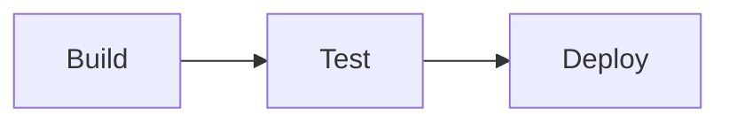

# Theming

Mermaider uses a normalized CSS custom-property token system. Every diagram type reads from the same set of `--` variables embedded in the SVG's `<style>` block, so changing colors once affects all diagram types uniformly. On top of the colours, a **style preset** decides how things are painted (outlines, fills, containers, labels, markers), again for every diagram type at once.

## Style presets

Three presets restyle all 24 diagram types, light and dark. They only change paint: layout, colours and font sizes are identical, so switching preset never moves a box.

| Preset | Look |
|---|---|
| `DiagramStyle.Quiet` (default) | Calm: tinted boxes with a soft top-to-bottom gradient, containers with a 28px header strip and an accent mark, outlined label pills, rounded bends. |
| `DiagramStyle.Blueprint` | Technical drawing: outline-first boxes on the page colour, square corners, dashed containers with a caps tab, mono captions with a halo, thin accent arrowheads, no shadows. |
| `DiagramStyle.Tonal` | Friendly tonal blocks: soft filled boxes without outlines, generous radii, chip headers, filled label chips, chunky markers, soft elevation. |

```csharp
var options = new RenderOptions
{
    Style     = DiagramStyle.Blueprint,
    Gradient  = true,   // top-to-bottom fills; false = flat fills
    Tint      = 1.0,    // 0.5–1.5: strength of every derived tint
    Elevation = 1,      // 0 none, 1 boxes + containers, 2 adds an ambient shadow
};
```

| Option | Type | Default | Effect |
|---|---|---|---|
| `Style` | `DiagramStyle` | `Quiet` | The preset (above). |
| `Gradient` | `bool` | `true` | Gradient fills on boxes, containers (an accent wash) and bars. Off: flat fills. |
| `Tint` | `double?` | `1` | Scales every tint derived from a colour (node fills, header bands, container bodies, borders). Clamped to 0.5–1.5; lower values keep dark themes from looking muddy. |
| `Elevation` | `int?` | `1` | Drop-shadow strength, clamped to 0–2. Blueprint never draws shadows. The shadow colour follows the background (lighter on light pages, deeper on dark ones). |

From the CLI: `--style <quiet|blueprint|tonal>`, `--no-gradient`, `--tint <0.5-1.5>`, `--elevation <0|1|2>`.

The accent colour is the "look here" colour in every preset: start/end terminals, decisions, notes, container marks, the diagram title mark and similar highlights. The full knob table and the rules renderers follow are in [`DESIGN.md`](https://github.com/nullean/mermaider/blob/main/DESIGN.md).

## Color tokens

| Token | Default | Role |
|---|---|---|
| `--bg` | `#FFFFFF` | Canvas background |
| `--fg` | `#27272A` | Primary text and strokes |
| `--accent` | `#3b82f6` | Arrow heads, active edges, highlights |
| `--muted` | derived | Secondary text, edge labels |
| `--surface` | derived | Node fill tint |
| `--border` | derived | Node and group strokes |
| `--line` | derived | Edge paths |

`derived` tokens are computed via `color-mix(in srgb, var(--fg) X%, var(--bg))` — they automatically adapt when `--fg` and `--bg` are overridden. You rarely need to set them explicitly.

Internally the renderer derives a fixed set of neutrals from these (secondary text at 72% of `--fg`, muted text 64%, lines 50%, soft rules 14%, …), chosen so text keeps at least 4.5:1 contrast and lines 3:1. Every coloured element (a cluster of nodes, a container, a chart series, the accent, a role) is a **colour family**: one base colour from which the gradient stops, flat fill, header band, container tint, border, outline and text ink are all mixed against `--bg` / `--fg`, so they re-theme with the page.

## Setting colors

Pass any hex color or CSS value via `RenderOptions`:

```csharp
var options = new RenderOptions
{
    Bg      = "#0D1117",   // dark background
    Fg      = "#E6EDF3",   // light text
    Accent  = "#58A6FF",   // blue edges
};

string svg = MermaidRenderer.RenderSvg(diagram, options);
```

## Transparent background

`Transparent` defaults to `true` — the SVG has no background rectangle, so it inherits whatever is behind it. Set `Transparent = false` to fill the canvas with `Bg`:

```csharp
var options = new RenderOptions { Transparent = false, Bg = "#FFFFFF" };
```

## Fonts

```csharp
var options = new RenderOptions
{
    Font     = "Inter",               // proportional text
    MonoFont = "JetBrains Mono",      // code-style text (ER types, Class signatures)
    FontSize = "0.9rem",              // base size token --fs-m
};
```

`MonoFont` falls back to the system monospace stack when `null`. Font families must already be loaded in the host page — Mermaider does not embed web font `@import` rules in SVG output.

## Font scale

The type scale is derived from `FontSize` via fixed ratios you can override:

| Option | Ratio | Token |
|---|---|---|
| `FontSize` | 1× | `--fs-m` |
| `FontSizeSmall` | 0.875 | `--fs-s` |
| `FontSizeExtraSmall` | 0.75 | `--fs-xs` |
| `FontSizeLarge` | 1.125 | `--fs-l` |

## Categorical data palette

Pie, sankey, timeline, radar, gitgraph, mindmap, venn, journey, packet, xychart, and treemap use a categorical color palette for series data. Override it with any array of CSS color strings:

```csharp
var options = new RenderOptions
{
    DataPalette = ["#7FE0FF", "#D66FFF", "#B6D9FF", "#E19BFF", "#4A8CFF"]
};
```

When `null`, the built-in palette is used.

Flowchart, state, ER and class diagrams colour their clusters, subgraphs and entities from this palette **minus the hues of the
colour roles below**, so an automatically coloured box never looks like a success or a failure.

## Colour roles

Roles are optional. The zinc themes (and the built-in default) set `Default` (an ordinary box) to a cool slate (`#64748b` light, `#94a3b8` dark) so the blue accent stands out; other themes leave it unset, in which case it is the first palette colour that is not a role hue. Unset, and the others are the palette's green, red, yellow and blue (brighter on dark themes).

```csharp
var options = new RenderOptions
{
    Default = "#4e79a7",
    Success = "#198038",
    Failure = "#da1e28",
    Warning = "#f1c21b",
    Info    = "#0f62fe",
};
```

In a diagram, give a node (or state) the class `success`, `failure`, `warning` or `info`:



An explicit `style` / `classDef` fill always wins. With strict styling the class must be on your allow-list.

## Shape colours

Shapes with a conventional meaning are tinted automatically: decisions (`{}` and state `<<choice>>`), terminals (`([])`) and data
stores (`[()]`). Everything else keeps its cluster colour.

## Layout spacing

```csharp
var options = new RenderOptions
{
    Padding      = 40,   // canvas padding in px
    NodeSpacing  = 28,   // horizontal gap between siblings
    LayerSpacing = 48,   // vertical gap between layers
    RoundedEdges = true, // rounded bends on edge paths (radius from the style preset)
};
```
