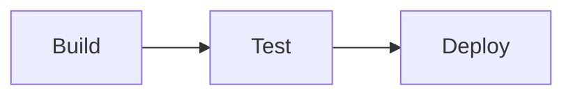

# Theming

Every diagram type is drawn by one design system. Colours come from a small set of CSS custom properties written on the `<svg>` element, and everything else is mixed from them inside the SVG's `<style>` block. On top of the colours, a **style preset** decides how things are painted (outlines, fills, containers, labels, markers), again for every diagram type at once.

## Built-in themes

15 themes ship in `Themes.BuiltIn`:

| Theme | Family |
|---|---|
| `zinc-light` | Default light (also `Themes.Default`) |
| `zinc-dark` | Default dark |
| `tokyo-night` / `tokyo-night-storm` / `tokyo-night-light` | Tokyo Night |
| `catppuccin-mocha` / `catppuccin-latte` | Catppuccin |
| `nord` / `nord-light` | Nord |
| `dracula` | Dracula |
| `github-light` / `github-dark` | GitHub |
| `solarized-light` / `solarized-dark` | Solarized |
| `one-dark` | One Dark |

A diagram can pick a theme in its own source:

```text
%%{init: {"theme": "tokyo-night"}}%%
flowchart LR
  A --> B
```

From code, copy the theme's values into `RenderOptions`. Copy the roles and the data palette too, or the diagram falls back to the `zinc-light` roles:

```csharp
var t = Themes.BuiltIn["tokyo-night"];
var options = new RenderOptions
{
    Bg = t.Bg, Fg = t.Fg, Line = t.Line, Accent = t.Accent, Muted = t.Muted,
    DataPalette = t.DataPalette,
    Default = t.Default, Success = t.Success, Failure = t.Failure, Warning = t.Warning, Info = t.Info,
};
```

From the CLI: `-t <name>` (or `--theme`), and `--list-themes` prints the names.

Colours resolve in this order, each step overriding the previous one:

1. The diagram's `%%{init}%%` theme, or `zinc-light` when it names none (or an unknown theme).
2. Any colour set in `RenderOptions`.
3. The diagram's `themeVariables`: `background`, `primaryTextColor`, `lineColor` and `primaryColor` (the accent).

[Strict styling](../security/index.md#strict-styling) drops the source theme and `themeVariables`, so only the host's colours apply. Every colour value is checked against an allowlist; an invalid value falls back to the previous step.

## Style presets

Three presets restyle all 24 diagram types, light and dark. They only change paint: layout, colours and font sizes are identical, so switching preset never moves a box.

| Preset | Look |
|---|---|
| `DiagramStyle.Quiet` (default) | Calm: tinted boxes with a soft top-to-bottom gradient, containers with a 28px header strip in their own colour, edge labels in pills outlined in the line colour, rounded bends. |
| `DiagramStyle.Blueprint` | Technical drawing: outline-first boxes on the page colour, square corners, dashed containers with a caps tab, mono captions with a halo, thin accent arrowheads, no shadows. |
| `DiagramStyle.Tonal` | Friendly tonal blocks: soft filled boxes without outlines, generous radii, chip headers, filled label chips, chunky markers, soft elevation. |


```csharp
var options = new RenderOptions
{
    Style     = DiagramStyle.Blueprint,
    Gradient  = true,   // top-to-bottom fills; false = flat fills
    Tint      = 1.0,    // 0.5–1.5: strength of every derived tint
    Elevation = 1,      // 0 none, 1 boxes + containers, 2 adds an ambient shadow
};
```

| Option | Type | Default | Effect |
|---|---|---|---|
| `Style` | `DiagramStyle` | `Quiet` | The preset (above). |
| `Gradient` | `bool` | `true` | Gradient fills on boxes, containers (a lighter shade of their own colour), bars and pie slices. Off: flat fills. |
| `Tint` | `double?` | `1` | Scales every tint derived from a colour (node fills, header bands, container bodies, borders). Clamped to 0.5–1.5; lower values keep dark themes from looking muddy. |
| `Elevation` | `int?` | `1` | Drop-shadow strength, clamped to 0–2. Blueprint never draws shadows; Tonal shadows boxes but not containers. |

The shadow colour is never a fixed value: it is mixed from the theme. On light pages it is the foreground at low strength; on dark pages it is the background deepened, so the shadow keeps the theme's own hue.

From the CLI: `--style <quiet|blueprint|tonal>`, `--no-gradient`, `--tint <0.5-1.5>`, `--elevation <0|1|2>`. The CLI rejects out-of-range values with an error.

The accent colour is the "look here" colour in every preset: terminals, decisions, notes, activation bars, the diagram title mark and similar highlights, plus the arrowheads in Blueprint. The full knob table and the rules renderers follow are in [`DESIGN.md`](https://github.com/nullean/mermaider/blob/main/DESIGN.md).

## Color tokens

| Token | Option | Default | Role |
|---|---|---|---|
| `--bg` | `Bg` | `#FFFFFF` | Canvas background |
| `--fg` | `Fg` | `#27272A` | Primary text, including edge labels |
| `--line` | `Line` | default box border | Connectors, axes and rules. Unset, it is the border of an ordinary box: `Border` when set, else `color-mix(in srgb, <Default> 74%, var(--fg))` |
| `--accent` | `Accent` | `#3b82f6` | The "look here" colour (see above) |
| `--muted` | `Muted` | derived | Secondary text: captions, axis ticks, types, meta text |
| `--surface` | `Surface` | unset | Optional fill of ordinary boxes; see [Box surface and border](#box-surface-and-border) |
| `--border` | `Border` | unset | Optional outline of ordinary boxes; see [Box surface and border](#box-surface-and-border) |

`derived` values are computed with `color-mix(in srgb, var(--fg) X%, var(--bg))`, so they adapt when `--fg` and `--bg` change. You rarely need to set them.

Internally the renderer derives a fixed set of neutrals from these (secondary text at 72% of `--fg`, muted text 64%, soft rules 14%, strong rules 68%, …), chosen so text keeps at least 4.5:1 contrast and lines 3:1 in the built-in themes.

### Colour families

Every coloured element (a cluster of nodes, a container, a chart series, the accent, a role) is a **colour family**: one base colour from which every stage is mixed against `--bg` or `--fg`.

| Stage | Mix | Used for |
|---|---|---|
| Gradient top / bottom | 15% / 7% of the base into `--bg` | Box fill (Quiet) |
| Flat | 11% into `--bg` | Box fill with `Gradient = false` |
| Band | 22% into `--bg` | Header bands, badges |
| Soft | 26% into `--bg` | Tonal fills |
| Tint | 6% into `--bg`, +3% per nesting level | Container bodies |
| Edge | 42% into `--bg` | Container borders, soft rules |
| Stroke | 74% into `--fg` | Box outlines, markers |
| Ink | 44% into `--fg` | Container titles, badge text |

`Tint` multiplies every `--bg`-side ratio. Because each stage is a `color-mix`, a family re-themes with the page.

## Setting colors

Pass any hex color or CSS color value via `RenderOptions`:

```csharp
var options = new RenderOptions
{
    Bg      = "#0D1117",   // dark background
    Fg      = "#E6EDF3",   // light text
    Accent  = "#58A6FF",   // highlights
};

string svg = MermaidRenderer.RenderSvg(diagram, options);
```

Options you leave unset come from the theme (`zinc-light` unless the diagram names one). On a dark `Bg`, also set the [colour roles](#colour-roles) and `DataPalette`, or copy them from a dark built-in theme.

## Colour roles

Five roles give boxes a meaning: `Default` (an ordinary box), `Success`, `Failure`, `Warning` and `Info`. Every shipped theme sets all five explicitly. The zinc themes use a cool slate `Default` (`#64748b`, `#94a3b8` on `zinc-dark`) so the blue accent stands out; the other themes use their own palette's colours.

```csharp
var options = new RenderOptions
{
    Default = "#4e79a7",
    Success = "#198038",
    Failure = "#da1e28",
    Warning = "#f1c21b",
    Info    = "#0f62fe",
};
```

The line colour follows the `Default` role: unless `Line` is set, connectors are drawn in the border colour of an ordinary box (`Border` when set), so lines and boxes read as one family.

In a diagram, give a node (or state) the class `success`, `failure`, `warning` or `info`:



An explicit `style` / `classDef` fill always wins. With strict styling the class must be on your allow-list.

## Box surface and border

`Surface` and `Border` are optional explicit overrides for ordinary boxes. Set them when you want a fixed fill and
outline instead of the colours derived from the `Default` role. No built-in theme sets either one.

```csharp
var options = new RenderOptions
{
    Surface = "#FEFCE8",   // fill of ordinary boxes
    Border  = "#A16207",   // their outline
};
```

They apply to every box painted in the `Default` colour family, the first cluster:

| Box | `Surface` paints | `Border` paints |
|---|---|---|
| Flowchart, state and block nodes, sequence participants, architecture services, C4 people, packet fields | The whole box | The box outline |
| Class, ER and requirement entities | The header band | The frame and the rule under the header |
| Entities without rows | The whole box | The box outline |

`Surface` is a solid fill in every style: it replaces the Quiet gradient, the Blueprint knock-out and the Tonal soft
fill. `Border` keeps each style's outline width. Tonal draws no outlines, so `Border` changes no box there.

Other clusters, role classes (`:::success` …), decisions (accent), terminals and data stores (neutral), containers and
charts keep their derived colours. Mindmap branches, timeline periods, journey sections and kanban columns start at
the second cluster, so the overrides do not reach them.

Unless `Line` is set, connectors follow `Border`. This also replaces the line colour a built-in theme spells out. An
explicit `Line` always wins. Terminals and data stores are mixed from the line colour, so they follow it as well.

Both are caller options: diagram source (`%%{init}%%`, `classDef`, `style`) never sets them, and unsafe values are
ignored like any other colour option.

## Automatic colours

Flowchart, state, ER and class diagrams give each connected cluster of nodes one colour family. The first cluster takes the `Default` role; the rest take the data palette **minus the hues of the `Success`, `Failure` and `Warning` roles**, so an automatically coloured box never looks like a success or a failure. Containers (subgraphs, namespaces) take their own palette colour, never the colour of a member.

Shapes with a conventional meaning override the cluster colour: decisions (`{}` and state `<<choice>>`) take the accent, and terminals (`([])`) and data stores (`[()]`) take the neutral line family.

## Categorical data palette

Pie, sankey, timeline, radar, gitgraph, mindmap, venn, journey, packet, xychart, and treemap use a categorical palette for series data. Override it with any array of CSS color strings:

```csharp
var options = new RenderOptions
{
    DataPalette = ["#7FE0FF", "#D66FFF", "#B6D9FF", "#E19BFF", "#4A8CFF"]
};
```

When `null`, the theme's palette is used: 12 colours based on a Tableau palette, with a brightened variant on the dark themes.

## Transparent background

`Transparent` defaults to `true`: the SVG has no background, so it inherits whatever is behind it. Set `Transparent = false` to fill the canvas with `Bg`:

```csharp
var options = new RenderOptions { Transparent = false, Bg = "#FFFFFF" };
```

## Fonts

```csharp
var options = new RenderOptions
{
    Font     = "Inter",               // proportional text
    MonoFont = "JetBrains Mono",      // ER types, class signatures, Blueprint captions
    FontSize = "0.9rem",              // base size token --fs-m
};
```

`Font` defaults to `Inter`. `MonoFont` falls back to the system monospace stack when `null`. Font families must already be loaded in the host page: Mermaider does not embed web font `@import` rules in SVG output.

## Font scale

The type scale is derived from `FontSize` (default `1rem`) via fixed ratios you can override:

| Option | Ratio | Token |
|---|---|---|
| `FontSize` | 1× | `--fs-m` |
| `FontSizeSmall` | 0.875 | `--fs-s` |
| `FontSizeExtraSmall` | 0.75 | `--fs-xs` |
| `FontSizeLarge` | 1.125 | `--fs-l` |

## Layout spacing

Flowchart and state diagrams read three spacing options. Other diagram types use fixed spacing.

```csharp
var options = new RenderOptions
{
    Padding      = 16,   // canvas padding in px (default 16)
    NodeSpacing  = 36,   // gap between siblings in a layer (default 36)
    LayerSpacing = 40,   // gap between layers (default 40; state diagrams use at most 30)
    RoundedEdges = true, // rounded bends on edge paths (radius from the style preset)
};
```
