# Mermaid — Mermaider grand tour and stress test

A single file that exercises every diagram type Mermaider supports, plus the ones not yet implemented. Useful as a living spec, a visual regression baseline, and a manual smoke-test when making rendering changes.

## Supported

### Flowchart

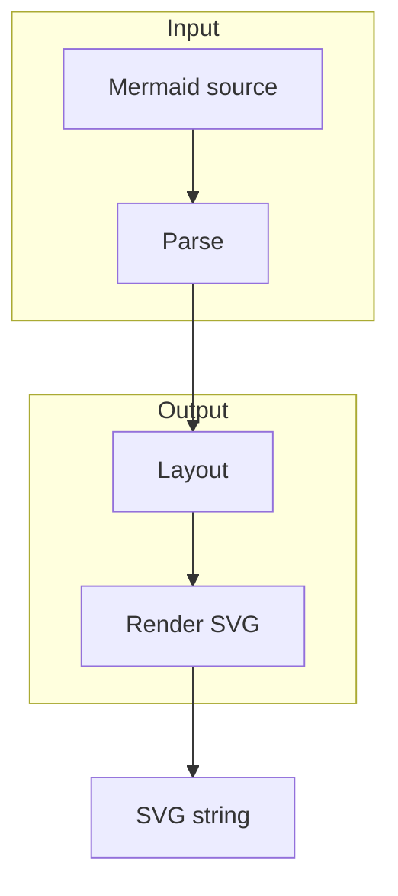
```mermaid
flowchart TB
    subgraph input[Input]
        SRC[Mermaid source] --> PARSE[Parse]
    end
    subgraph output[Output]
        LAYOUT[Layout] --> RENDER[Render SVG]
    end
    PARSE --> LAYOUT
    RENDER --> SVG[SVG string]
```

### Sequence

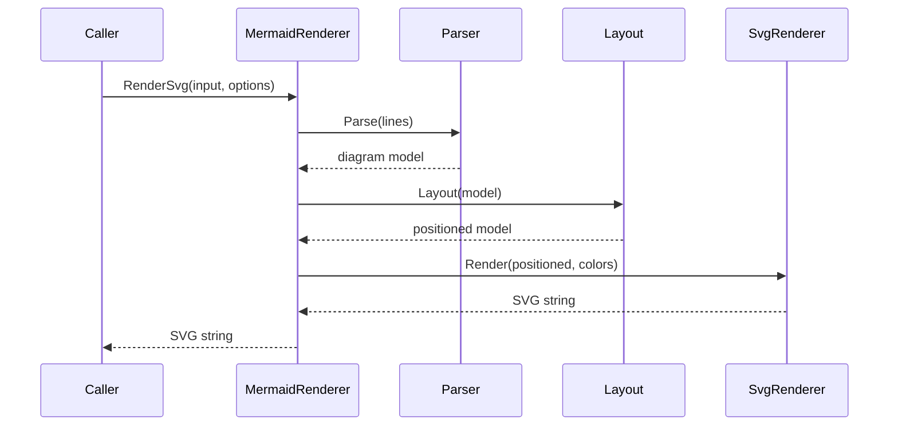
```mermaid
sequenceDiagram
    participant C as Caller
    participant M as MermaidRenderer
    participant P as Parser
    participant L as Layout
    participant R as SvgRenderer
    C->>M: RenderSvg(input, options)
    M->>P: Parse(lines)
    P-->>M: diagram model
    M->>L: Layout(model)
    L-->>M: positioned model
    M->>R: Render(positioned, colors)
    R-->>M: SVG string
    M-->>C: SVG string
```

### State

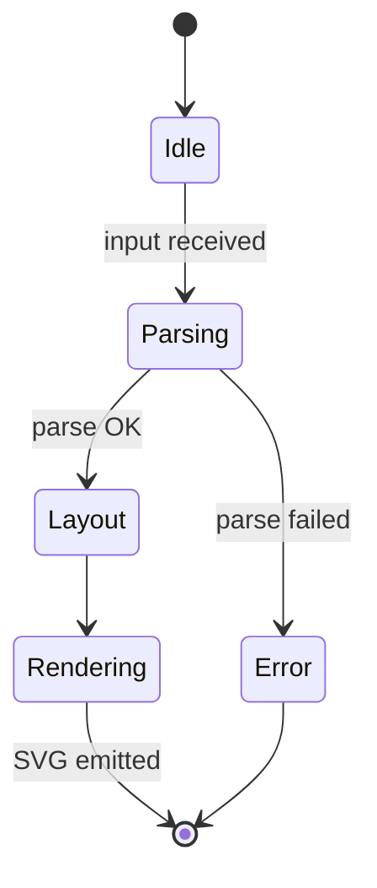
```mermaid
stateDiagram-v2
    [*] --> Idle
    Idle --> Parsing: input received
    Parsing --> Layout: parse OK
    Parsing --> Error: parse failed
    Layout --> Rendering
    Rendering --> [*]: SVG emitted
    Error --> [*]
```

### Class

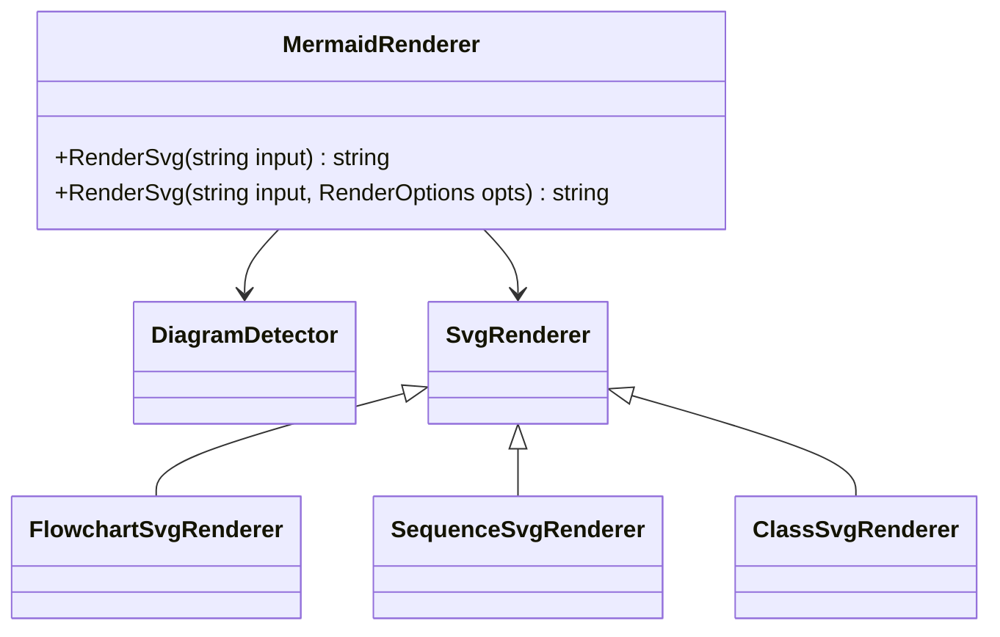
```mermaid
classDiagram
    MermaidRenderer --> DiagramDetector
    MermaidRenderer --> SvgRenderer
    SvgRenderer <|-- FlowchartSvgRenderer
    SvgRenderer <|-- SequenceSvgRenderer
    SvgRenderer <|-- ClassSvgRenderer
    MermaidRenderer : +RenderSvg(string input) string
    MermaidRenderer : +RenderSvg(string input, RenderOptions opts) string
```

### Entity-relationship

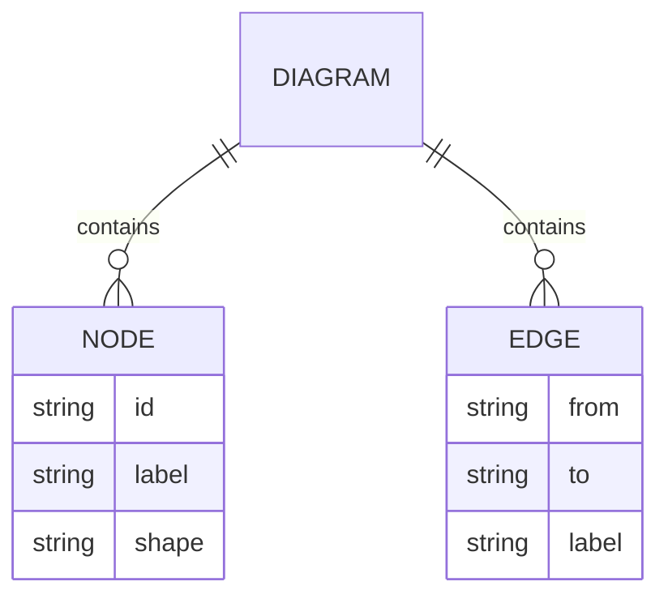
```mermaid
erDiagram
    DIAGRAM ||--o{ NODE : contains
    DIAGRAM ||--o{ EDGE : contains
    NODE {
        string id
        string label
        string shape
    }
    EDGE {
        string from
        string to
        string label
    }
```

### Git graph

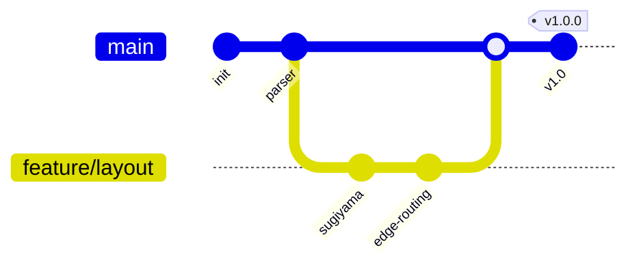
```mermaid
gitGraph
    commit id: "init"
    commit id: "parser"
    branch feature/layout
    commit id: "sugiyama"
    commit id: "edge-routing"
    checkout main
    merge feature/layout
    commit id: "v1.0" tag: "v1.0.0"
```

### Mindmap

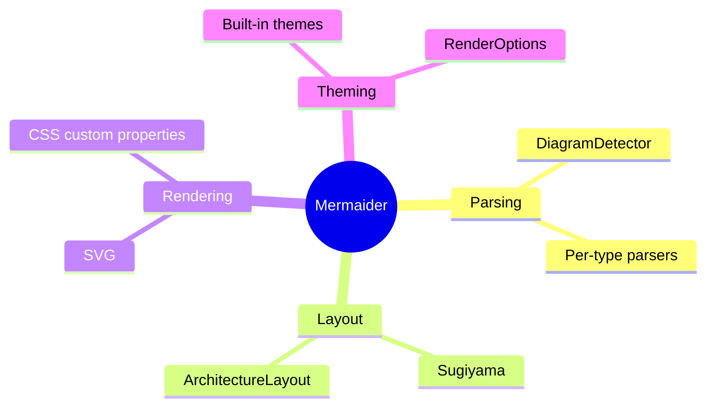
```mermaid
mindmap
  root((Mermaider))
    Parsing
      DiagramDetector
      Per-type parsers
    Layout
      Sugiyama
      ArchitectureLayout
    Rendering
      SVG
      CSS custom properties
    Theming
      Built-in themes
      RenderOptions
```

### Timeline

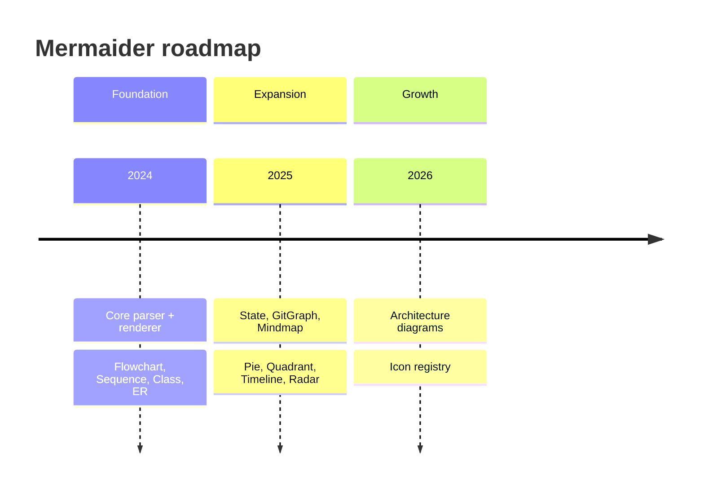
```mermaid
timeline
    title Mermaider roadmap
    section Foundation
    2024 : Core parser + renderer
         : Flowchart, Sequence, Class, ER
    section Expansion
    2025 : State, GitGraph, Mindmap
         : Pie, Quadrant, Timeline, Radar
    section Growth
    2026 : Architecture diagrams
         : Icon registry
```

### Quadrant

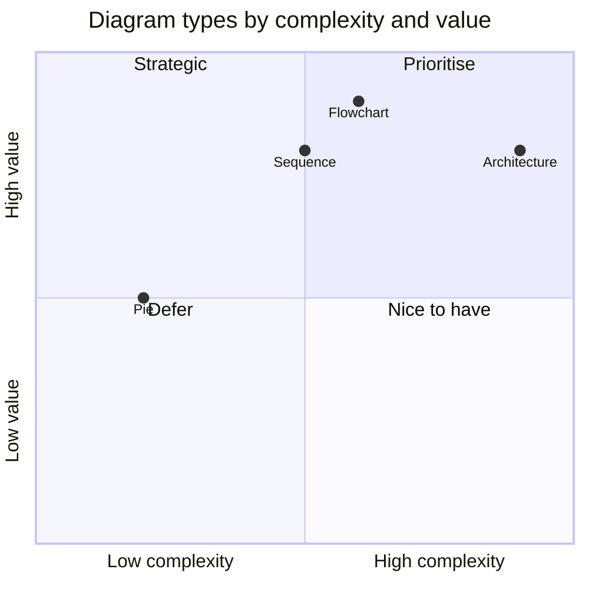
```mermaid
quadrantChart
    title Diagram types by complexity and value
    x-axis Low complexity --> High complexity
    y-axis Low value --> High value
    quadrant-1 Prioritise
    quadrant-2 Strategic
    quadrant-3 Defer
    quadrant-4 Nice to have
    Flowchart: [0.6, 0.9]
    Sequence: [0.5, 0.8]
    Architecture: [0.9, 0.8]
    Pie: [0.2, 0.5]
```

### Pie (header on its own line)

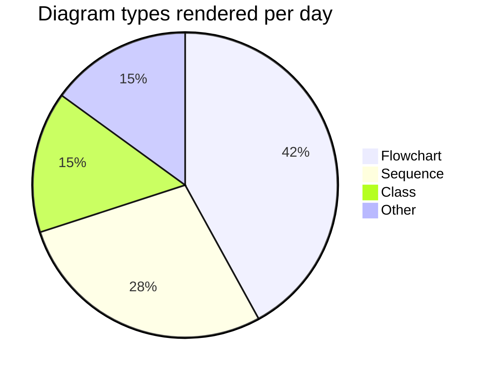
```mermaid
pie
    title Diagram types rendered per day
    "Flowchart" : 42
    "Sequence" : 28
    "Class" : 15
    "Other" : 15
```

### Radar

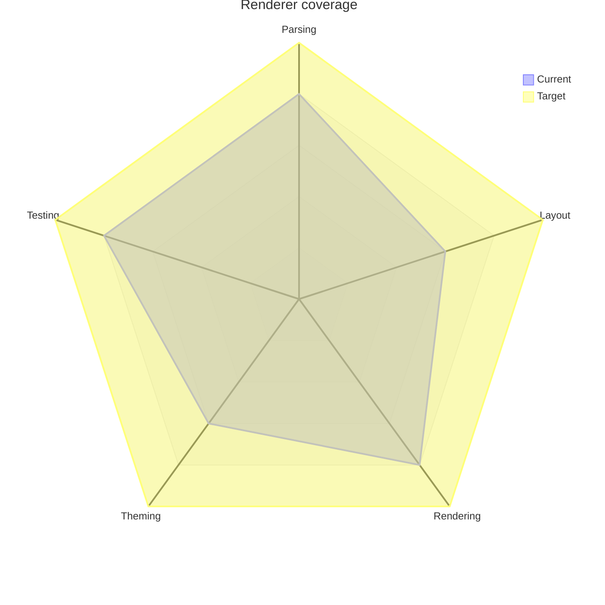
```mermaid
radar-beta
    title Renderer coverage
    axis Parsing, Layout, Rendering, Theming, Testing
    curve Current{4, 3, 4, 3, 4}
    curve Target{5, 5, 5, 5, 5}
    max 5
    graticule polygon
```

### Treemap

```mermaid
treemap-beta
    "Parsing": 30
    "Layout": 25
    "Rendering": 30
    "Tests": 15
```

### Venn

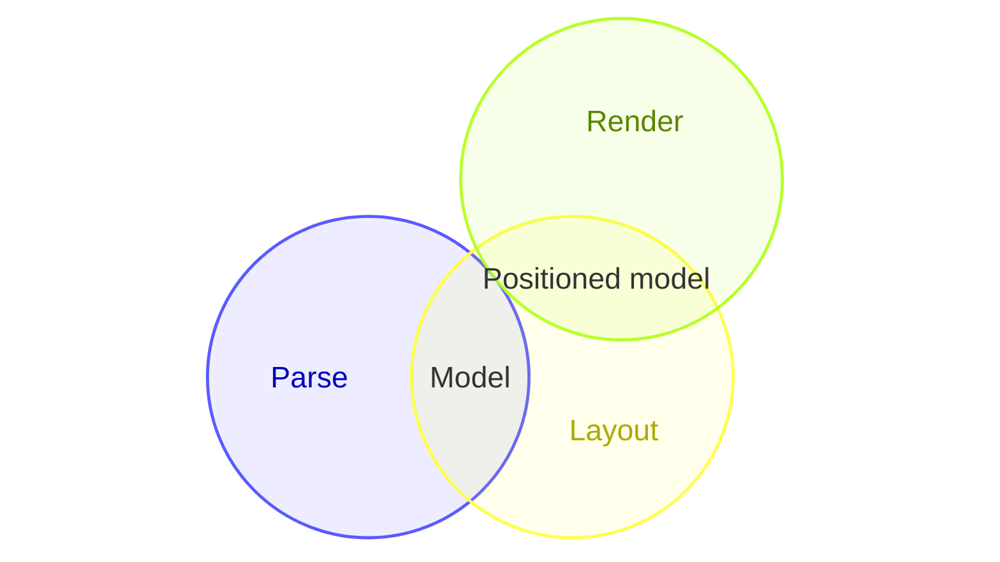
```mermaid
venn-beta
    set A["Parse"]
    set B["Layout"]
    set C["Render"]
    union A,B["Model"]
    union B,C["Positioned model"]
```

## Inline-title header forms (fixed in #14)

These previously fell through — the title token on the opening keyword line was not consumed. All three now parse correctly.

### Pie with inline title

```mermaid
pie title Diagram types rendered per day
    "Flowchart" : 42
    "Sequence" : 28
    "Class" : 15
    "Other" : 15
```

### Pie with showData and inline title

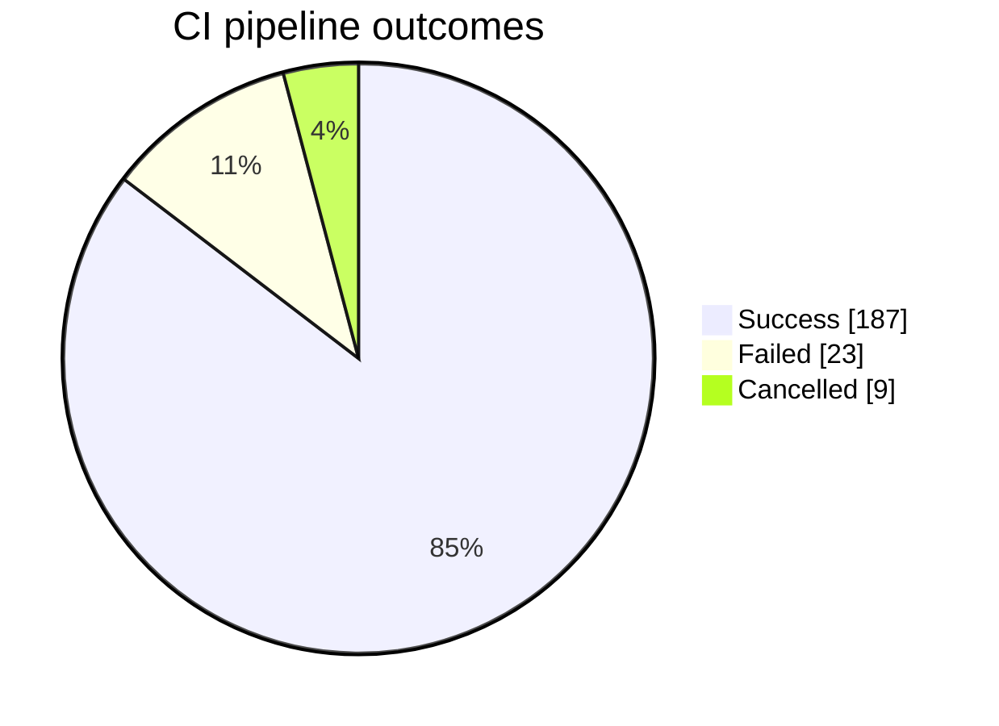
```mermaid
pie showData title CI pipeline outcomes
    "Success" : 187
    "Failed" : 23
    "Cancelled" : 9
```

### Quadrant with inline title

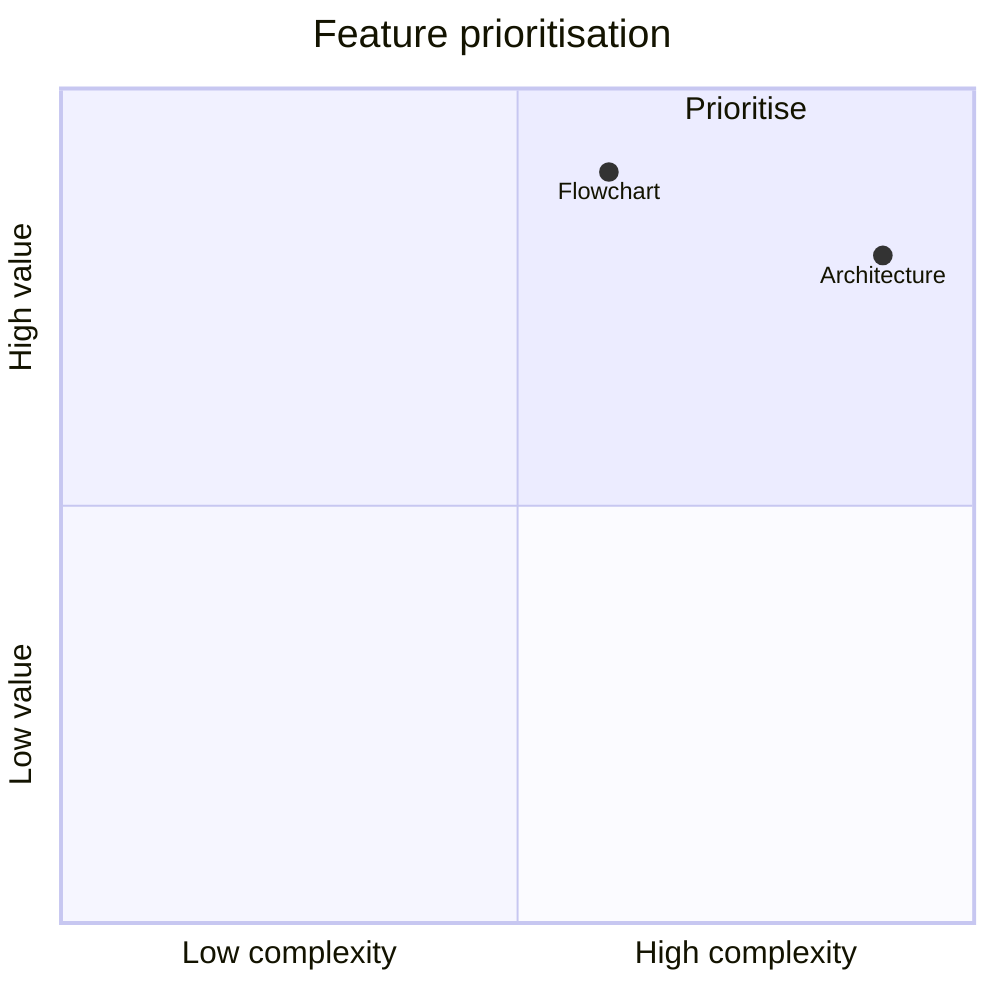
```mermaid
quadrantChart title Feature prioritisation
    x-axis Low complexity --> High complexity
    y-axis Low value --> High value
    quadrant-1 Prioritise
    Flowchart: [0.6, 0.9]
    Architecture: [0.9, 0.8]
```

### Timeline with inline title

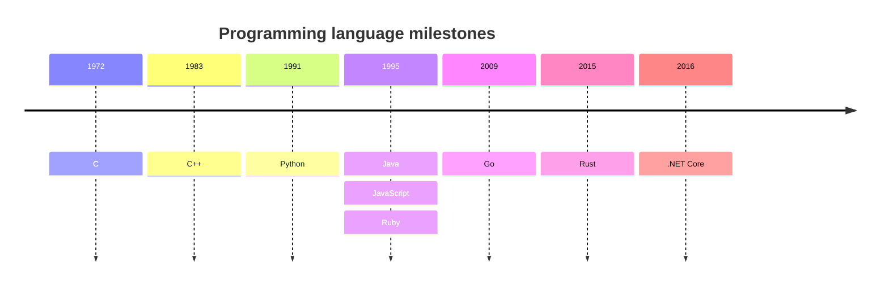
```mermaid
timeline title Programming language milestones
    1972 : C
    1983 : C++
    1991 : Python
    1995 : Java : JavaScript : Ruby
    2009 : Go
    2015 : Rust
    2016 : .NET Core
```

## Not yet implemented

Diagram types below are parsed and will be supported in upcoming PRs.

### Gantt

```mermaid
gantt
    title Mermaider milestone plan
    dateFormat  YYYY-MM-DD
    section Parsers
    Gantt parser     :done,   a1, 2026-07-01, 2d
    XY parser        :active, a2, after a1,   1d
    section Renderers
    Gantt renderer   :crit,   after a2, 3d
    XY renderer      :        after a2, 2d
```

### XY Chart

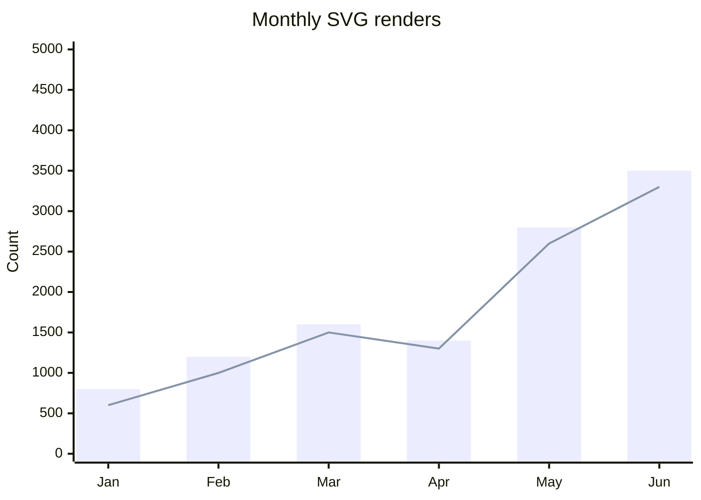
```mermaid
xychart-beta
    title "Monthly SVG renders"
    x-axis [Jan, Feb, Mar, Apr, May, Jun]
    y-axis "Count" 0 --> 5000
    bar  [800, 1200, 1600, 1400, 2800, 3500]
    line [600, 1000, 1500, 1300, 2600, 3300]
```

### Sankey

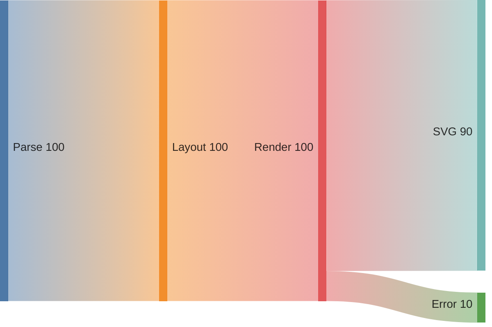
```mermaid
sankey-beta
    Parse, Layout, 100
    Layout, Render, 100
    Render, SVG, 90
    Render, Error, 10
```

### User Journey

```mermaid
journey
    title Developer integrates Mermaider
    section Discovery
      Read README: 5: Dev
      Check NuGet: 4: Dev
    section Integration
      Add package: 5: Dev
      Call RenderSvg: 5: Dev
      Embed SVG: 4: Dev
    section Production
      Ship it: 5: Dev
```

### Requirement Diagram

```mermaid
requirementDiagram

requirement render_svg {
id: 1
text: RenderSvg must return valid SVG for all supported diagram types.
risk: high
verifymethod: test
}

element mermaider {
type: library
}

mermaider - satisfies -> render_svg
```

### C4 Context

```mermaid
C4Context
    title Mermaider in a typical .NET app

    Person(dev, "Developer", "Calls MermaidRenderer.RenderSvg")
    System(mermaider, "Mermaider", "Pure .NET Mermaid parser, layout engine, and SVG renderer")
    System_Ext(browser, "Browser / viewer", "Displays the returned SVG")

    Rel(dev, mermaider, "RenderSvg(input)")
    Rel(mermaider, browser, "returns SVG string")
```

### Kanban

```mermaid
kanban
  Backlog
    Gantt renderer
    XY chart renderer
    Sankey renderer
  In Progress
    User Journey renderer
    C4 renderer
  Done
    Flowchart
    Sequence
    Architecture
```

### Block Diagram

```mermaid
block-beta
columns 3
  P["Parse"] L["Layout"] R["Render"]
  D["Detect"] S["Sugiyama"] V["SVG"]
```

### Packet

```mermaid
packet-beta
0-15: "Source port"
16-31: "Destination port"
32-63: "Sequence number"
```

### Architecture

```mermaid
architecture-beta
    group api(cloud)[Mermaider pipeline]

    service parser(server)[Parser]
    service layout(server)[Layout]
    service renderer(server)[Renderer]

    parser:R --> layout:L
    layout:R --> renderer:L
```

---

## Support matrix

| Diagram type | Keyword(s) | Supported |
|---|---|---|
| Flowchart | `flowchart` / `graph` | Yes |
| Sequence | `sequenceDiagram` | Yes |
| State | `stateDiagram` / `stateDiagram-v2` | Yes |
| Class | `classDiagram` | Yes |
| ER | `erDiagram` | Yes |
| Git graph | `gitGraph` | Yes |
| Mindmap | `mindmap` | Yes |
| Pie | `pie` | Yes — including `pie title X` and `pie showData title X` on header line |
| Quadrant | `quadrantChart` | Yes — including `quadrantChart title X` on header line |
| Timeline | `timeline` | Yes — including `timeline title X` on header line |
| Radar | `radar-beta` | Yes |
| Treemap | `treemap-beta` | Yes |
| Venn | `venn-beta` | Yes |
| Gantt | `gantt` | Planned |
| XY chart | `xychart-beta` | Planned |
| Sankey | `sankey-beta` | Planned |
| User journey | `journey` | Planned |
| Requirement | `requirementDiagram` | Planned |
| C4 | `C4Context` / `C4Container` / … | Planned |
| Kanban | `kanban` | Planned |
| Block | `block-beta` | Planned |
| Packet | `packet-beta` | Planned |
| Architecture | `architecture-beta` | Yes |
