# Mermaid — grand tour and stress test

A single file that exercises every diagram type Mermaider supports, plus the ones not yet implemented. Useful as a living spec, a visual regression baseline, and a manual smoke-test when making rendering changes.

## Supported

### Flowchart, with subgraphs and decisions

Direction, shapes, edge labels, two subgraphs, and a decision node.

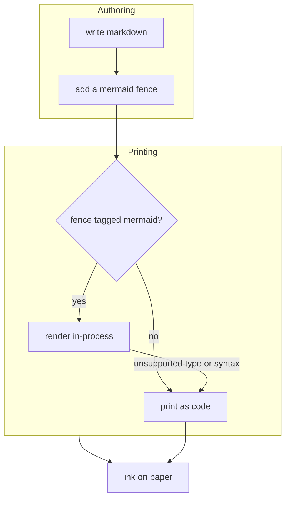
```mermaid
flowchart TB
    subgraph authoring[Authoring]
        MD[write markdown] --> FENCE[add a mermaid fence]
    end
    subgraph printing[Printing]
        PARSE{fence tagged mermaid?}
        PARSE -->|yes| RENDER[render in-process]
        PARSE -->|no| CODE[print as code]
        RENDER -->|unsupported type or syntax| CODE
    end
    FENCE --> PARSE
    RENDER --> PAGE[ink on paper]
    CODE --> PAGE
```

### Sequence, with alt, opt, and a note

Lifelines, solid and dashed arrows, alt + opt blocks, and a note.

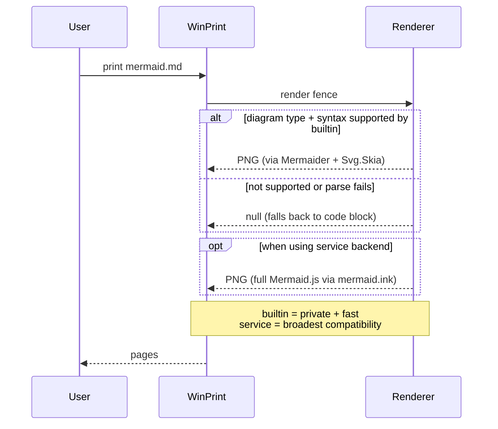
```mermaid
sequenceDiagram
    participant U as User
    participant W as WinPrint
    participant R as Renderer
    U->>W: print mermaid.md
    W->>R: render fence
    alt diagram type + syntax supported by builtin
        R-->>W: PNG (via Mermaider + Svg.Skia)
    else not supported or parse fails
        R-->>W: null (falls back to code block)
    end
    opt when using service backend
        R-->>W: PNG (full Mermaid.js via mermaid.ink)
    end
    Note over W,R: builtin = private + fast<br/>service = broadest compatibility
    W-->>U: pages
```

### State

Every printer I have ever owned:

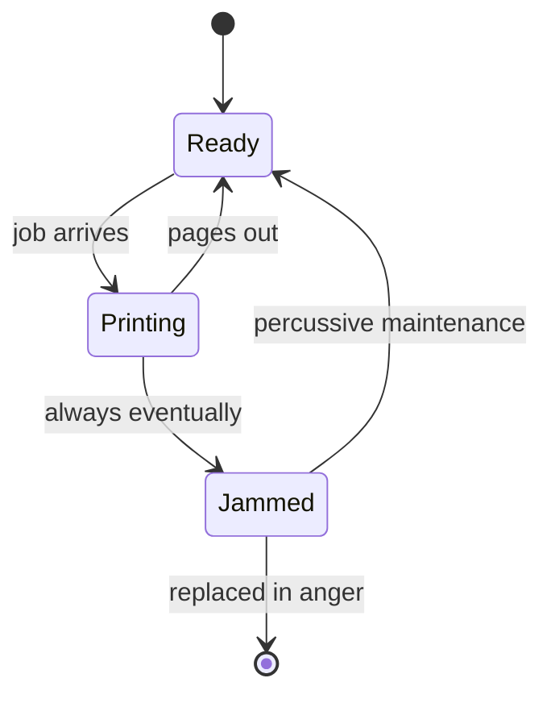
```mermaid
stateDiagram-v2
    [*] --> Ready
    Ready --> Printing: job arrives
    Printing --> Ready: pages out
    Printing --> Jammed: always eventually
    Jammed --> Ready: percussive maintenance
    Jammed --> [*]: replaced in anger
```

### Class

The inheritance hierarchy nobody asked to see printed, printed:

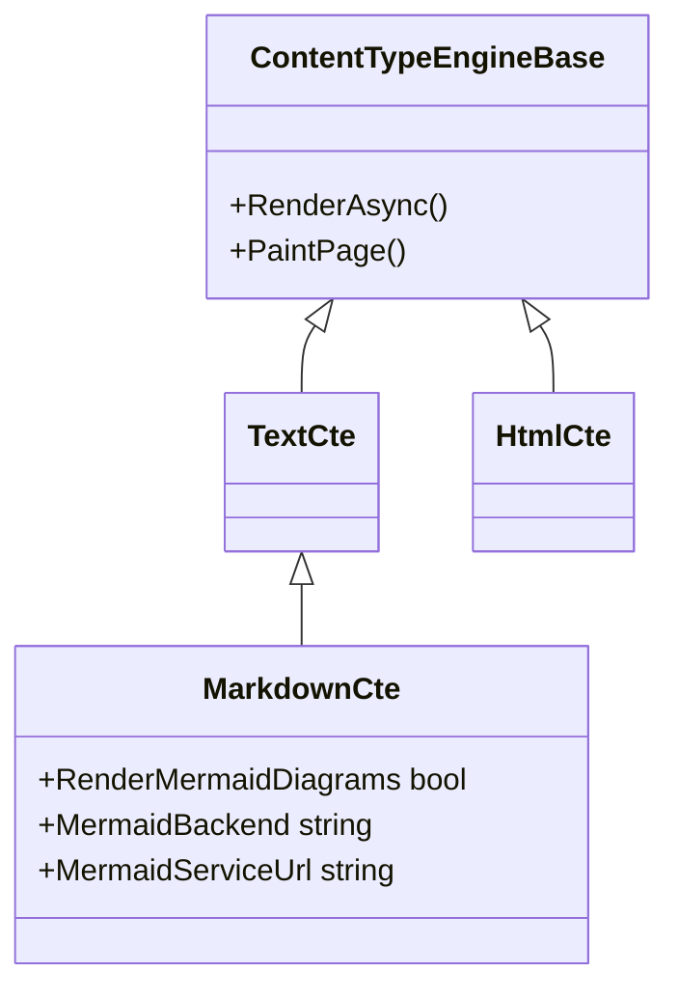
```mermaid
classDiagram
    ContentTypeEngineBase <|-- TextCte
    TextCte <|-- MarkdownCte
    ContentTypeEngineBase <|-- HtmlCte
    ContentTypeEngineBase : +RenderAsync()
    ContentTypeEngineBase : +PaintPage()
    MarkdownCte : +RenderMermaidDiagrams bool
    MarkdownCte : +MermaidBackend string
    MarkdownCte : +MermaidServiceUrl string
```

### Entity-relationship

A database for a printing app, which is to say, over-engineering:

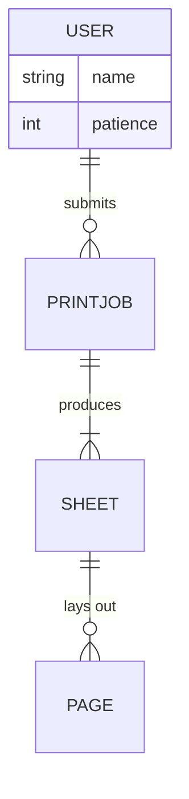
```mermaid
erDiagram
    USER ||--o{ PRINTJOB : submits
    PRINTJOB ||--|{ SHEET : produces
    SHEET ||--o{ PAGE : "lays out"
    USER {
        string name
        int patience
    }
```

### Git graph

Every release, ever:

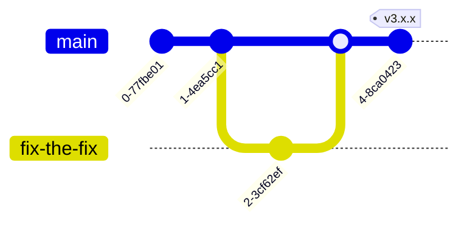
```mermaid
gitGraph
    commit
    commit
    branch fix-the-fix
    commit
    checkout main
    merge fix-the-fix
    commit tag: "v3.x.x"
```

### Mindmap

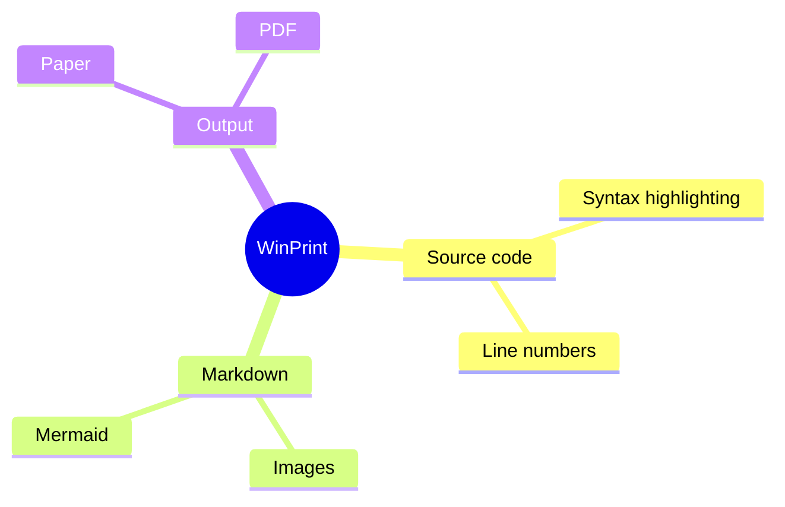
```mermaid
mindmap
  root((WinPrint))
    Source code
      Syntax highlighting
      Line numbers
    Markdown
      Images
      Mermaid
    Output
      Paper
      PDF
```

### Timeline

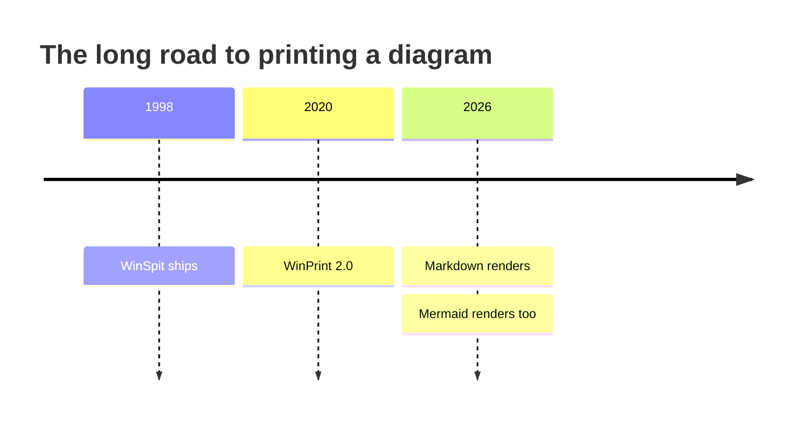
```mermaid
timeline
    title The long road to printing a diagram
    1998 : WinSpit ships
    2020 : WinPrint 2.0
    2026 : Markdown renders
         : Mermaid renders too
```

### Quadrant

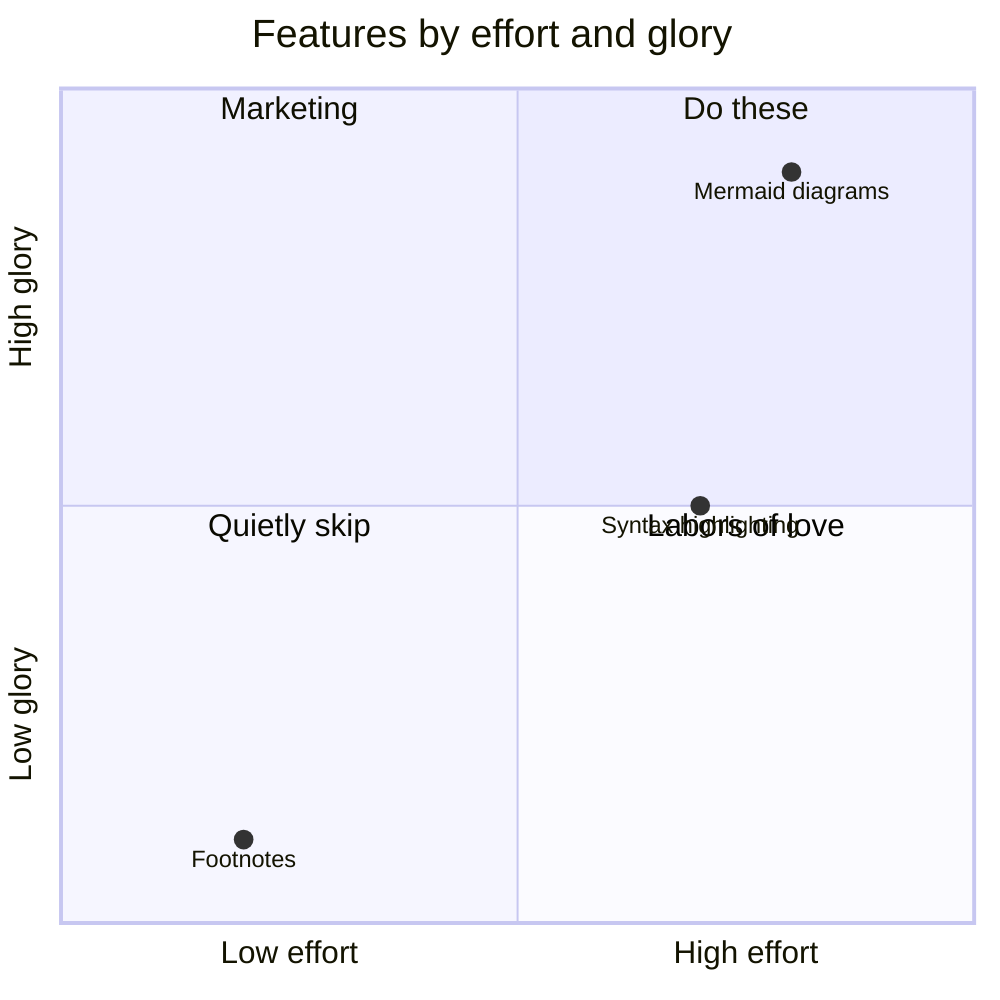
```mermaid
quadrantChart
    title Features by effort and glory
    x-axis Low effort --> High effort
    y-axis Low glory --> High glory
    quadrant-1 Do these
    quadrant-2 Marketing
    quadrant-3 Quietly skip
    quadrant-4 Labors of love
    Syntax highlighting: [0.7, 0.5]
    Mermaid diagrams: [0.8, 0.9]
    Footnotes: [0.2, 0.1]
```

### Pie (title on its own line)

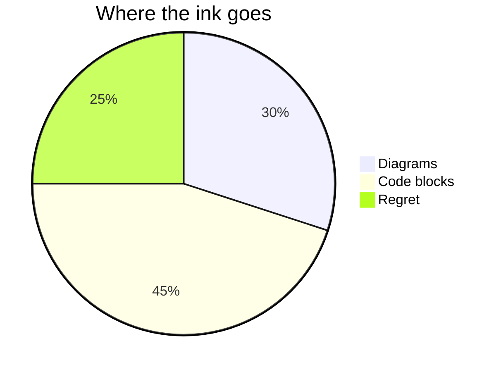
```mermaid
pie
    title Where the ink goes
    "Diagrams" : 30
    "Code blocks" : 45
    "Regret" : 25
```

### Radar (beta)

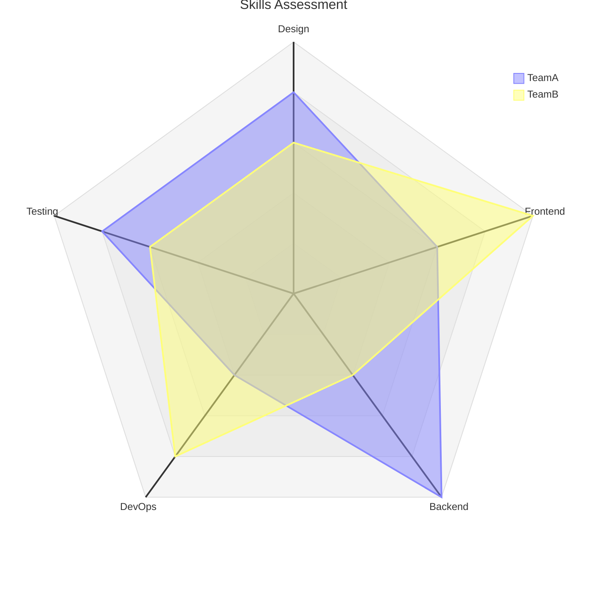
```mermaid
radar-beta
    title Skills Assessment
    axis Design, Frontend, Backend, DevOps, Testing
    curve TeamA{4, 3, 5, 2, 4}
    curve TeamB{3, 5, 2, 4, 3}
    max 5
    graticule polygon
```

### Treemap (beta)

```mermaid
treemap-beta
    "Core Rendering": 40
    "Mermaid Support": 15
    "TUI": 20
    "Maui GUI": 15
    "Docs + Tests": 10
```

### Venn (beta)

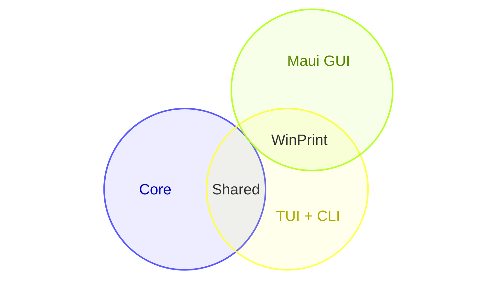
```mermaid
venn-beta
    set Core["Core"]
    set TUI["TUI + CLI"]
    set GUI["Maui GUI"]
    union Core,TUI["Shared"]
    union TUI,GUI["WinPrint"]
```

## Inline-title header forms (fixed in #14)

These use the compact `keyword title …` form on the opening line. Previously Mermaider's detector rejected them; they now parse correctly.

### Pie with title on the header line

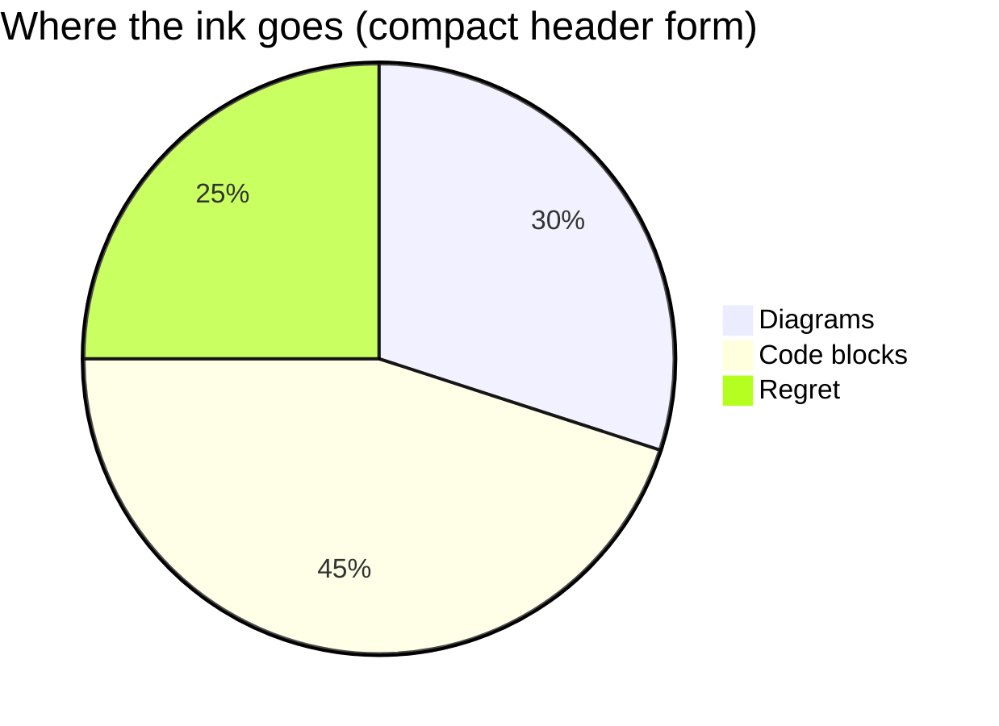
```mermaid
pie title Where the ink goes (compact header form)
    "Diagrams" : 30
    "Code blocks" : 45
    "Regret" : 25
```

### Quadrant with title on header line

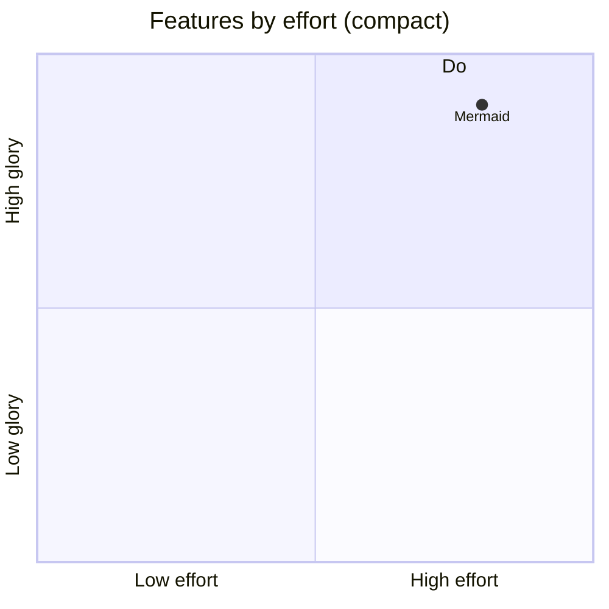
```mermaid
quadrantChart title Features by effort (compact)
    x-axis Low effort --> High effort
    y-axis Low glory --> High glory
    quadrant-1 Do
    Mermaid: [0.8, 0.9]
```

### Timeline with title on header line

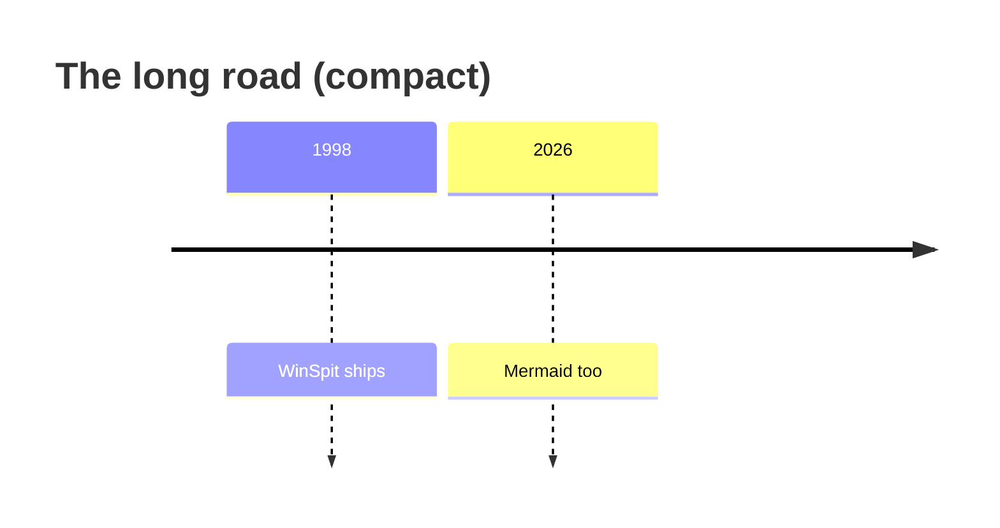
```mermaid
timeline title The long road (compact)
    1998 : WinSpit ships
    2026 : Mermaid too
```

## Not yet implemented

The diagram types below are not yet supported by Mermaider.

### Gantt

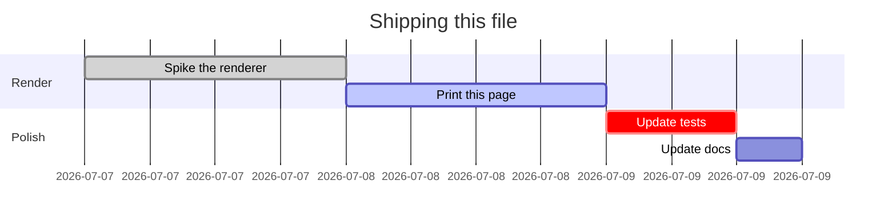
```mermaid
gantt
    title Shipping this file
    dateFormat  YYYY-MM-DD
    section Render
    Spike the renderer :done, a1, 2026-07-07, 1d
    Print this page    :active, a2, after a1, 1d
    section Polish
    Update tests       :crit, after a2, 12h
    Update docs        : 6h
```

### XY Chart

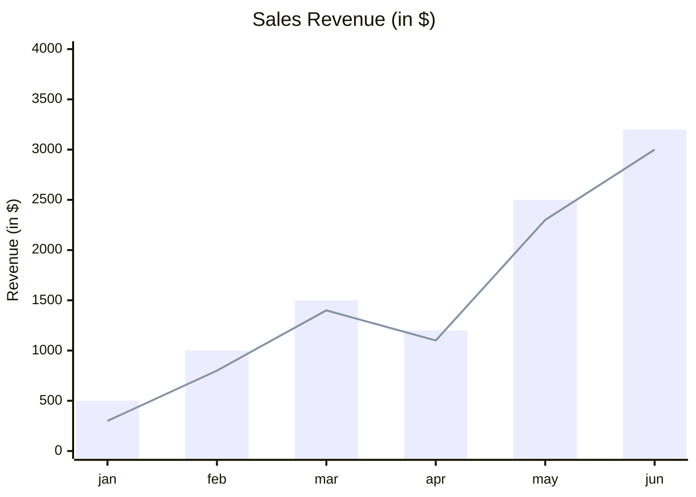
```mermaid
xychart-beta
    title "Sales Revenue (in $)"
    x-axis [jan, feb, mar, apr, may, jun]
    y-axis "Revenue (in $)" 0 --> 4000
    bar [500, 1000, 1500, 1200, 2500, 3200]
    line [300, 800, 1400, 1100, 2300, 3000]
```

### Sankey

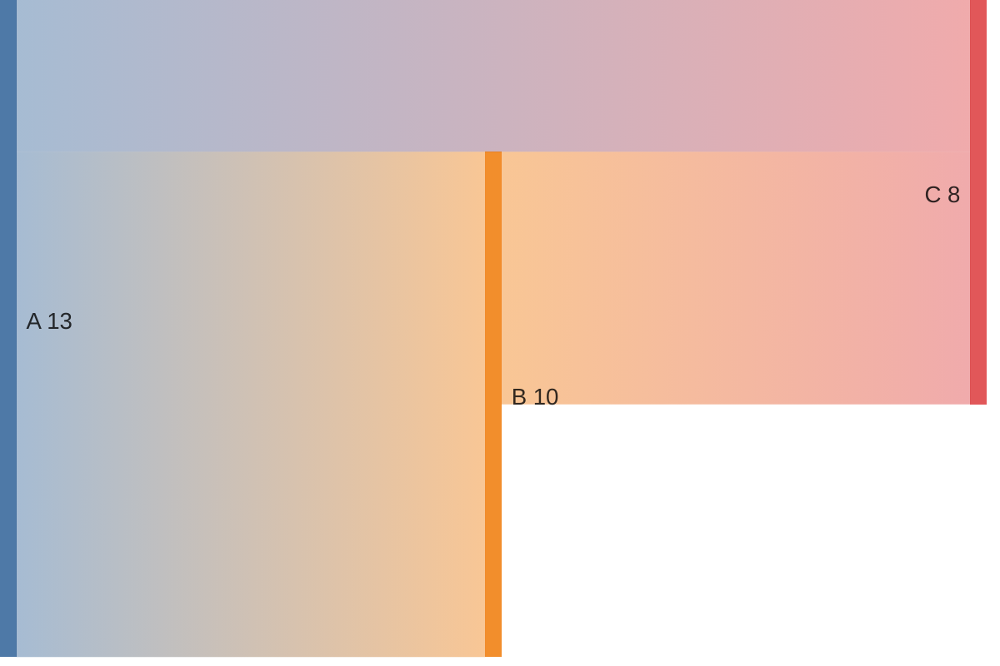
```mermaid
sankey-beta
    A, B, 10
    B, C, 5
    A, C, 3
```

### User Journey

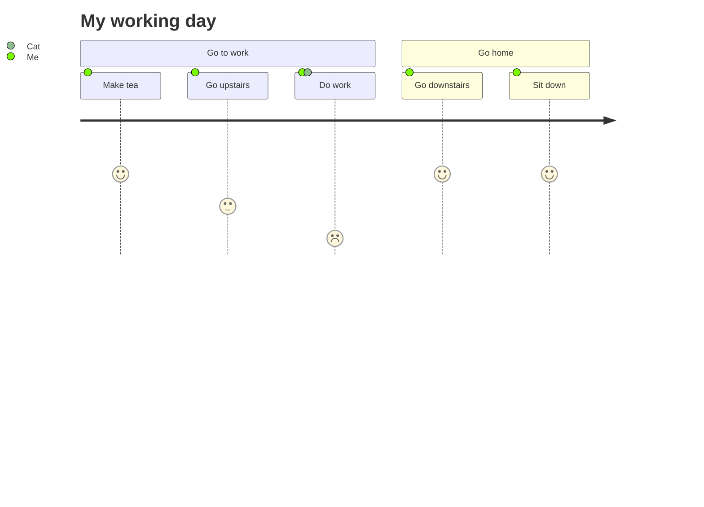
```mermaid
journey
    title My working day
    section Go to work
      Make tea: 5: Me
      Go upstairs: 3: Me
      Do work: 1: Me, Cat
    section Go home
      Go downstairs: 5: Me
      Sit down: 5: Me
```

### Requirement Diagram

```mermaid
requirementDiagram

requirement test_req {
id: 1
text: the test text.
risk: high
verifymethod: test
}

element test_entity {
type: simulation
}

test_entity - satisfies -> test_req
```

### C4 Context

```mermaid
C4Context
    title System Context diagram for Internet Banking System

    Person(customerA, "Banking Customer A", "A customer of the bank, with personal bank accounts.")
    System_Boundary(banking_system, "Internet Banking System") {
        Container(web_app, "Web Application", "Java, Spring MVC", "Delivers the static content and the Internet banking SPA")
    }

    Rel(customerA, web_app, "Uses")
```

### Kanban

```mermaid
kanban
  Todo
    Task1
    Task2
  In Progress
    Task3
  Done
    Task4
```

### Block Diagram

```mermaid
block-beta
columns 3
  A["A"] B["B"] C["C"]
  D["D"] E["E"] F["F"]
```

### Packet

```mermaid
packet-beta
0-15: "Header"
16-31: "Source"
32-47: "Destination"
```

### Architecture (beta)

```mermaid
architecture-beta
    group api(cloud)[API]

    service db(cloud)[Database]
    service disk(cloud)[Disk]

    api:B --> db:T
    api:B --> disk:T
```

---

## Support matrix

| Diagram type | Keyword(s) | Supported |
|---|---|---|
| Flowchart | `flowchart` / `graph` | Yes |
| Sequence | `sequenceDiagram` | Yes |
| State | `stateDiagram` / `stateDiagram-v2` | Yes |
| Class | `classDiagram` | Yes |
| ER | `erDiagram` | Yes |
| Git graph | `gitGraph` | Yes |
| Mindmap | `mindmap` | Yes |
| Pie | `pie` | Yes — including `pie title X` and `pie showData title X` on header line |
| Quadrant | `quadrantChart` | Yes — including `quadrantChart title X` on header line |
| Timeline | `timeline` | Yes — including `timeline title X` on header line |
| Radar | `radar-beta` | Yes |
| Treemap | `treemap-beta` | Yes |
| Venn | `venn-beta` | Yes |
| Architecture | `architecture-beta` | Yes |
| Gantt | `gantt` | Planned |
| XY chart | `xychart-beta` | Planned |
| Sankey | `sankey-beta` | Planned |
| User journey | `journey` | Planned |
| Requirement | `requirementDiagram` | Planned |
| C4 | `C4Context` / `C4Container` / … | Planned |
| Kanban | `kanban` | Planned |
| Block | `block-beta` | Planned |
| Packet | `packet-beta` | Planned |
